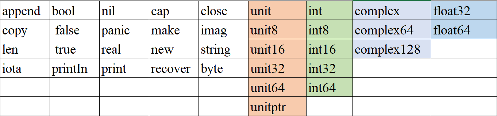
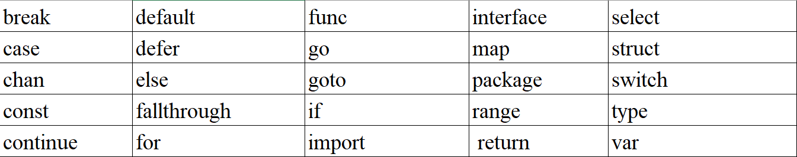

# 1. 前言

> 本文档参考golang官方文档以及一些教程书籍，若文档有错误，欢迎issue :hugs:
>
> 1. https://go.dev/doc/tutorial/
> 2. 参考书籍《Go语言开发实战》


Go语言是Google公司发布的一种静态型、编译型的开源编程语言，是新时代的`C语言`。Go语言已经成为**云计算时代**的重要基础编程语言。

2012年3月28日，Go发布第一个正式的稳定版本。


# 2. Go语言的特性

> 自由高校

1. 编译效率优于 java C++
2. 运行效率接近 C
3. 开发效率接近 PHP 
4. Go语言支持所有编程范式：过程式编程，面向对象编程，面向接口编程，函数式编程

> 强大的标准库

1. 标准库涵盖 网络 系统 加密编码 图形。
2. 网络和系统的库非常实用，几乎不需要依赖第三方库

> 部署方便

1. Go语言不使用虚拟机， Go语言的代码可以直接输出为 目标平台的二进制可执行文件。
2. Go语言拥有自己的链接器，不依赖任何系统提供的编译器和链接器。
3. 编译出来的二进制可执行文件几乎可以运行在任何平台上

> 原生支持并发

1. Go语言的并发基于 Go routine
2. Go routine 类似于线程，但是并非线程。是Go面向线程的轻量级方法。
3. 创建 Go routine的成本很低，只需要几千个字节的额外内存。
4. Go routine 之间可以通过channel实现通信，基于channel的并发方法可以最大限度地使用CPU资源。

> 稳定性强 

1. Go有编译检查，严格的编码规范，强稳定性。
2. Go 提供了软件生命周期(开发，测试，部署，维护)的各个环节工具。go tool、 go fmt, go test。

> 垃圾回收

1. Go语言内置runtime来自动进行管理

   :bug:目前来说，GC并不完美，但是足以应付开发者遇到的大多数情况，Go语言允许开发者对词项工作进行优化。

# 3. Go使用范围

1. Go语言可以代替C 或者 C++做一些系统编程，如：日志处理，数据打包，虚拟机处理，文件系统。
2. 网络编程方面，包括Web应用，API应用，下载应用。
3. 知名开源项目：分布式系统中的Etcd, google的Groupcache数据库组件，云平台中的Docker和Kubernets，区块链中的Ethereum和Hyperledger.


# 4. Go语言的编码规范

Go语言的结构组成, 以下面的结构为例：

```go
package main // 定义了包名
import "fmt" //导入依赖包， fmt包实现了格式话输入输出
func main(){ // 程序入口
    fmt.printIn("Hello")
}
```

每一个Go应用程序都需要包含一个名为main的包，并且该包包含一个`main()`的函数，该函数是 go可执行程序的入口函数，即不能带有参数，也不能带有返回值。

:warning:需要注意的点：

1. 只有package名为main的包可以包含`main()`函数
2. 一个可执行程序有且只有一个`main()`函数
3. 通过import关键子来导入其他非`main()`包
4. import关键字可以单个导入，也可以多个导入

> 在Go语言中，换行代表一个语句结束，Go语言不需要像java一样以分号结尾。
>
> 如果多个语句写在同一行，这些语句必须使用分号隔开，实际开发中不鼓励这样做


# 5. Go的标识符

标识符号分为：

1. 预定义标识符，系统已经定义好的一些系统实体名称，比如 nil代表空
2. 自定义标识符，指用户给变量，类型，函数等程序实体起名字


<center>表1 Go语言预定义的标识符</center>



1. 类型之后的数字代表bit的位数。如`int16`代表 这个类型占16个bit, 共2字节。

2. uint 标识 unsinged int 代表无符号整数
3. 布尔类型无法参与数值运算，也无法与其他类型进行转换。


**标识符可见性规则**:Go语言中，使用大小写来决定标识符是否可以被外部包所调用。

> - 如果标识符以一个大写字母开头，那么这个标识符代表的对象对外部包是可见的。
> - 如果标识符以小写字母开头，则对外部包是不可见的

<center>表2 关键字</center>



# 6. 补充

>  GoLand快捷键

| 快捷键             | 说明               |
| ------------------ | ------------------ |
| Ctrl + J           | 快速提示           |
| Ctrl + Shift + ↑ ↓ | 上下移动行的内容   |
| Alt + ← →          | 文件编辑窗口切换   |
| Alt +  ↑ ↓         | 光标在相邻函数跳转 |
| Ctrl + D           | 向下复制行内容     |
| Ctrl + Y           | 删除当前行         |
| Ctrl + Alt + L     | 格式化代码         |

> Go环境配置的相关变量

- GOROOT: Go的安装路径
- GOPATH: Go的工程路径， 工程目录 用来存放开发者的代码，该环境变量被指定之后，编译源代码所生成的文件都会放到此目录下。GOPATH主要有三个目录：
  1. bin: 存放可执行文件
  2. pkg: 存放编译好的库文件
  3. src: 存放go的源代码。

通过 `go env`查看go语言环境配置