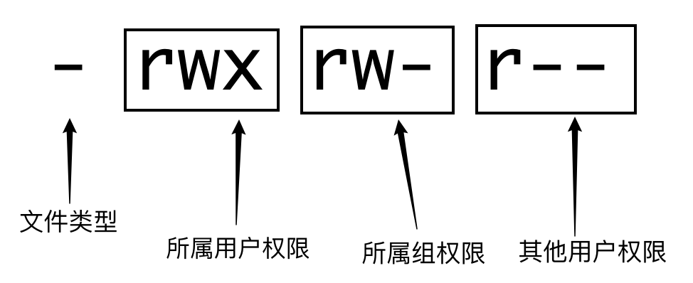

<center><h1>文件IO操作</h1></center>


# FileInfo

文件的信息包括文件名，文件大小，修改权限，修改时间等。

> FileInfo interface

Go语言系统文件信息接口属性定义如下：

```go
type FileInfo interface {
	Name() string       // base name of the file
	Size() int64        // length in bytes for regular files; system-dependent for others
	Mode() FileMode     // file mode bits
	ModTime() time.Time // modification time
	IsDir() bool        // abbreviation for Mode().IsDir()
  Sys() interface{}   // underlying data source (can return nil)
}
```

> fileStat结构体

```go
// A fileStat is the implementation of FileInfo returned by Stat and Lstat.
type fileStat struct {
	name    string
	size    int64
	mode    FileMode
	modTime time.Time
	sys     syscall.Stat_t
}
```

fileStat结构体的常用方法如下所示：

```go
func (fs *fileStat) Size() int64        { return fs.size }
func (fs *fileStat) Mode() FileMode     { return fs.mode }
func (fs *fileStat) ModTime() time.Time { return fs.modTime }
func (fs *fileStat) Sys() any           { return &fs.sys }
```

> 例子

```go
import (
	"fmt"
	"os"
)

func printMessage(filePath string) {
	fileInfo, err := os.Stat(filePath)
	if err == nil {
		fmt.Printf("%T\n", fileInfo)
		fmt.Println("fileName:", fileInfo.Name())
		fmt.Println("fileSize:", fileInfo.Size())
		fmt.Println("mode:", fileInfo.Mode()) // 文件权限
		fmt.Println("isDirectory:", fileInfo.IsDir())
		fmt.Println("Last modify:", fileInfo.ModTime())
	} else {
		fmt.Println("err:", err.Error())
	}
}

func main() {	
	// absolute path
	path := "/Users/lye/leetcode/leetcode_go/go.mod"
	printMessage(path)
	//*os.fileStat
	//fileName: go.mod
	//fileSize: 28
	//mode: -rw-r--r--
	//isDirectory: false
	//Last modify: 2022-10-05 12:04:51.902065812 +0800 CST

	// relative path
	path = "go.mod"
	printMessage(path)
	//*os.fileStat
	//fileName: go.mod
	//fileSize: 28
	//mode: -rw-r--r--
	//isDirectory: false
	//Last modify: 2022-10-05 12:04:51.902065812 +0800 CST
}
```

> 文件权限

文件的权限一共用10个字符描述，有三种基本权限：

- r (read, 读取权限) 八进制表示：4
- w (write, 写权限) 八进制表示：2
- x (execute, 执行权限) 八进制表示：1
- \- 无任何操作 八进制表示：0

文件权限说明：

 

如：-rwxrwxrwx:权限的八进制表示： 0777

> 文件路径

与文件路径相关的方法表示:

- filepath.IsAbs() 判断是否为绝对路径
- filepath.Rel() 获取相对路径
- filepath.Abs() 获取绝对路径
- path.Join() 拼接路径

# 文件常规操作

## 1. 创建目录

创建目录时，如果目录存在，则创建失败。Go语言提供了两种方法：

> os.MKdir(): 仅仅创建单级目录

Mkdir create a new directory with the specified name and permission bits. If there is an error, it will be of type *PathError.

> os.MKdirAll(): 创建多级目录

```go
func main() {
	dirName := "./test1"
	// 创建目录
	err := os.Mkdir(dirName, os.ModePerm)
	if err == nil {
		fmt.Println("the directory was created successfully, dirName=", dirName)
		// the directory was created successfully, dirName= ./test1
	} else {
		fmt.Println("error:", err.Error())
	}
	path2 := "./test2/abc/xyz"
	// 创建多级目录
	err = os.MkdirAll(path2, os.ModePerm)
	if err == nil {
		fmt.Println("the directory was created successfully, dirName=", path2)
		//the directory was created successfully, dirName= ./test2/abc/xyz
	} else {
		fmt.Println("error:", err.Error())
	}
}
```

## 2. 创建文件

> os.Create()： 如果文件存在，则将其覆盖

