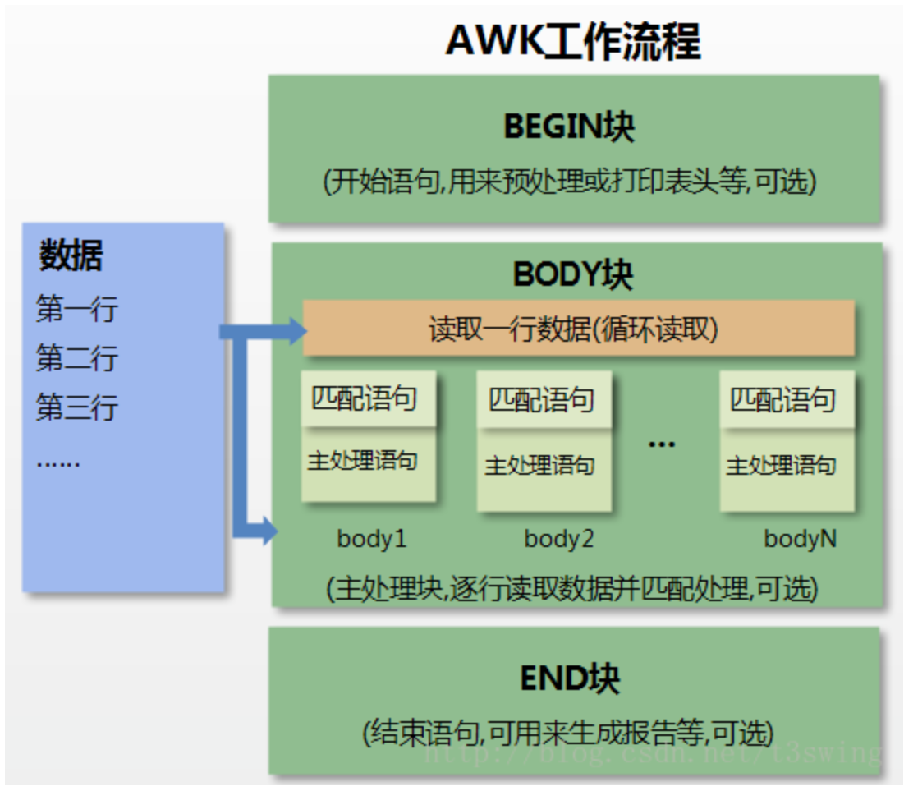

# Linux指令

# awk

> 介绍

数据过滤工具 (类似于grep，比grep强大)，属数据处理引擎，基于模式匹配检查输入文本，逐行处理并输出。通常用在Shell脚本中，获取指定的数据，单独使用时，可对文本数据做统计。

1. AWK 工作流程可分为三个部分：

- 读输入文件之前执行的代码段（由BEGIN关键字标识）。
- 主循环执行输入文件的代码段。
- 读输入文件之后的代码段（由END关键字标识）。

2. AWK工作流程：

 

> 语法格式

```shell
awk 'BEGIN{ commands } pattern{ commands } END{ commands }'
```

1、通过关键字 BEGIN 执行 BEGIN 块的内容，即 BEGIN 后花括号 **{}** 的内容。

2、完成 BEGIN 块的执行，开始执行body块。

3、读入有 **\n** 换行符分割的记录。

4、将记录按指定的域分隔符划分域，填充域，**$0** 则表示所有域(即一行内容)，**$1** 表示第一个域，**$n** 表示第 n 个域。

5、依次执行各 BODY 块，pattern 部分匹配该行内容成功后，才会执行 commands 的内容。

6、循环读取并执行各行直到文件结束，完成body块执行。

7、开始 END 块执行，END 块可以输出最终结果。

> 开始块 Begin【可选】

```shell
BEGIN {awk-commands}
```

开始块就是在程序启动的时候执行的代码部分，并且它在整个过程中只执行一次。一般情况下，我们可以在开始块中初始化一些变量。BEGIN 是 AWK 的关键字，因此它必须是大写的。

> 主体块 Body 

```shell
pattern {awk-commands}
```

对于每一个输入的行都会执行一次主体部分的命令。默认情况下，对于输入的每一行，AWK 都会执行命令。但是，我们可以将其限定在指定的模式中。

**注意**：在主体块部分没有关键字存在。

> 结束块 End

```shell
END {awk-commands}
```


## 1. Linux相关事项

1. 一切皆文件
2. Linux区分大小写
3. Linux的文件名避免使用特殊字符
   1. 文件名称不要有`/`字符
   2. 连字符`-`不要放在文件名的第一个字符， shell会解析为命令行的执行选项<option>
   3. 文件名最好不要用空格，因为shell会将空格视为参数之间的分隔符

4. **Linux通配符含义**

| 符号 | 说明                                                         |
| ---- | ------------------------------------------------------------ |
| *    | 匹配0个或者多个任意字符                                      |
| ?    | 匹配单个字符                                                 |
| [ ]  | 匹配一组单个字符， 如[123]，匹配1或2或3，如[1-3]表示一定范围内的字符 |
| {}   | 用于匹配字符串和范围，匹配必须用逗号分隔列表，{aa,bb}匹配 aa或者bb；{1..3}用于匹配范围，可以是字母，数字，但是不能同时为字母和数字 |

---

在介绍启动脚本之前，需要区分 分类shell的两种方式：

1. **登录和非登录**

   - 登录shell是操作系统在用户登录的时候启动的，bash会读取`/etc/profile`配置shell。此配置会应用于每一个用户。bash会按顺序查找如下文件

     `~/.bash_profile`

     `~/.bash_login`

     `~/.profile`

   - 非登录shell 是指用户不会登录到其中的shell

2. 交互和非交互

   - 交互shell会影响你输入的命令，并将输出发送到stdout(标准输出)和stderr
   - 非交互shell将由shell脚本使用， 在使用期间用户不会再输入命令。

在启动交互式非登录shell时，bash会读取并执行已存在的`/etc/bash.bashrc`，该操作会应用于使用bash的每位用户。

## 2.文件系统的相关命令

ls 列出文件和文件夹

ls [folder] 列出其他文件夹的内容

| 命令  | 全写                            | 说明                                          |
| ----- | ------------------------------- | --------------------------------------------- |
| ls -l | ls --format=long                | 以单独的一列显示内容列表                      |
| ls -m | ls --format=commas              | 以逗号为分隔符显示列表内容                    |
| ls -a | ls --all                        | 查看文件夹中所有文件，包括隐藏文件            |
| ls -A | 不显示当前目录`.`和父级目录`..` | 查看所有文件                                  |
| ls -F | ls --classify                   | 直观的显示文件的类型                          |
| ls -R | --recursive                     | 查看子文件夹中的文件列表                      |
| ls -r | --reverse                       | 基于文件名称的，以倒序列出文件的内容          |
| ls -t | --sort=time                     | 按照日期和时间的顺序对目录内容进行排序输出    |
| ls -S | --sore=size                     | 按照文件大小排序输出文件信息， 最下的优先展示 |
| ls -h | --human-readable                | 将文件大小用K，M，G单位表示输出               |

注意：ls -F显示文件的更多的信息，文件后面的`*`表示该文件是一个可执行文件，`/`表明是目录。如果文件夹中没有任何附加符号，就代表是一个普通文件。

| 符号 | 对应文件类型         |
| ---- | -------------------- |
| *    | 可执行文件           |
| /    | 目录                 |
| @    | 符号连接文件         |
| \|   | FIFO(也称为命名管道) |
| =    | 套接字               |

> **ls --color 以颜色显示文件内容**

| 颜色   | 对应的文件类型                           |
| ------ | ---------------------------------------- |
| 绿色   | 可执行文件                               |
| 蓝色   | 目录                                     |
| 紫红色 | 符号连接文件，套接字，图像文件，音频文件 |
| 黄色   | FIFO                                     |
| 红色   | 压缩文件                                 |

> ls -l 展示文件所有信息

输出的信息从左到右依次为：

1. 每个文件和目录的实际权限

   1. 实际权限 由10个字符表示，分为4组。第一个字符为一组，剩下的字符每三个为一组

      第一组表示文件类型

      | 字符 | 含义                   |
      | ---- | ---------------------- |
      | -    | 普通文件或者可执行文件 |
      | d    | 目录                   |
      | l    | 符号链接文件           |
      | s    | 套接字 socket          |
      | b    | 块设备                 |
      | c    | 字符设备               |
      | p    | 命名管道，又叫FIFO     |

      第二、三、四组分别表示文件的所有者，文件组以及系统其他用户拥有的权限。以`rwx|r-x|r--`为例，文件的所有者权限为`rwx`，文件的组拥有的权限为`r-x`， 系统的其他用户权限为`r--`

      其中

      `r`表示允许读取

      `w`表示允许修改

      `x`表示运行执行

      `-`表示不允许执行操作

      ---

      **对于文件夹来说**，

      `r`表示用户可以使用ls命令列出目录的内容

      `w`表示用户可以在目录中添加，删除，修改文件

      `x`表示可以通过执行某个命令而访问目录，或者是访问目录中的子目录

2. 文件的硬链接数目

   如果该文件是目录，则这个数字表示该目录包含的子目录个数，包含`.`和`..`目录

   如果不是目录，则这个数字表示该文件的硬链接的个数

3. 文件的所有者和所属组

4. 文件的大小

5. 文件名称

> touch

touch命令可以更新文件的访问和修改时间

- touch -a 仅仅更新访问时间
- touch -m 仅仅更新修改时间
- touch -t 将文件修改为任意所需时间。`-t[[CC]YY]MMDDhhmm[.ss]`

touch filename。 可以用于创建一个新的空文件

:warning:只有获得文件的写入权限才能对文件使用`touch`指令

> cd 修改当前的文件夹路径

- cd ~ 该为home路径
- cd - 回到上一个访问的路径

> mkdir -p （--parents） 创建嵌套的子目录

mkdir -p 目录/嵌套的子目录/子目录

---

> cp -i （--interactive） 防止在复制的时候覆盖重要文件

cp -r (--recursive) 复制目录以及目录中的所有文件

cp -a (--archive) 该选项可以确保cp命令不会复制软链接的内容

---

> mv 移动文件夹或者重命名文件夹

mv移动文件需要注意，如果移动的是软连接的文件，如文件名为`test`的软链接，指向的是`/tmp/test`的文件夹，则

```shell
mv test/ ~/directory
```

表示移动的软链接指向的文件，即移动的是`/tmp/test`文件

```shell
mv test ~/directory
```

表示移动的是软连接本身

- mv 重命名文件夹的指令 `mv test test_a`表示将`test`文件夹重命名为`test_a`

---

在创建文件时，文件系统会为其分配一个独特的索引节点号。在读取文件时候，linux获得存储在索引节点中的信息之后，就可以对该文件进行操作。如果要查看与文件关联的索引节点号，可以使用`ls -i`命令

大多数文件系统都会创建固定数量的索引节点。从理论上来说，如果索引节点已经用完，那么即使有大量的磁盘空间，也无法创建文件。

> ln （link）命令

目前存在两种链接，硬链接（默认链接类型）和软链接

``` shell
ln source_file link_name  # 创建硬链接
```

注意创建的硬链接和源文件大小一样，但是两种的文件索引节点是一样的。

> unlink 移除链接

```shell
unlink source_file
```

注意这样的方式会删除`source_flie`文件，但是可以使用`link_name`的文件，因为两者的文件内容一样，大小一样

注意，对于目录，无法创建硬链接，只能创建软连接；硬链接和源文件必须处于同一个文件系统。不可能将硬链接和源文件放在不同的分区上。（因为每一个分区都有自己独立的索引节点）

> ln -s 创建软连接

```shell
ln -s source_file link_name
```

注意：

1. 软链接的文件索引节点和源文件索引节点不一样，软链接和源文件不是同一个文件。而硬链接仅仅是共享索引节点的普通文件

2. 硬链接仅可以指向文件，软链接可以指向文件或文件夹

3. 软链接和源文件不需要再同一个文件系统中，如果移动或删除源文件，软链接就会失效

> rm -rf （-r :recursive）(-f: force)

```shell
rm -rf "file name" # 删除带空格的文件，用引号括起来
rm -- -filename # 删除文件名前面带-的文件名，如-test.txt
rm ./-file_name # 同上
```

## 3. 进阶

### man [manual]

使用`man`可以查看其他指令的相关信息，手册，如

```shell
man ls
```

- NAME: 命令的名称
- DESCRIPTION: 描述命令功能
- OPTIONS：选项

### whatis | man -f 基于命令查找功能

查看指令的功能

推荐使用`whatis`指令，因为`whatis`支持通配符`--wildcard`或者正则表达式`--regex`

```shell
whatis -w ls* # 使用通配符
whatis -r ^rm.*$ # 使用正则表达式
```

### apropos | man -k  基于功能查找命令

同样`apropos`命令可以使用通配符或者正则表达式，此外，还可以使用`-e` (exact) 来精确的查询某个命令。

### whereis

> locate the binary, source, and manual page files for a command

定位一个指令的可执行文件，源文件和手册页面的路径

where命令首先会报告源文件的位置，然后报告二进制可执行文件的位置，最后是手册页面的位置

```shell
$ whereis -b test # 查找二进制文件路径 binary
$ whereis -m test # 查找手册页面路径 manual
$ whereis -s test # 查找源文件路径 source
```

### which 

> locate a command

## 4.组合命令

>  使用`;`连续运行多个命令

命令栈就是将所有需要的命令放到`shell`中的一行上，每条命令用`;`隔开，然后`shell`按照命令的前后顺序依次执行

:warning:但是需要注意的是，不管上一条命令执行成功与否，下一条命令都会执行

> `&&` 

使用`&&`分隔符，只有上一条命令成功执行了，下一条命令才会执行，如果其中一条命令执行失败，整个命令栈就会停止运行

> `||`

仅仅在上一条命令执行失败了，才会执行下一条命令

```shell
$ command_1 || command_2 || ... # 相当于要么执行命令1，要么执行命令2
```

> `$()`

将一条命令的输出插入到另一条命令中

```shell
$ date "+%Y-%m-%d"
2022-03-21
$ mkdir $(date "+%Y-%m-%d") #创建以当前时间为名字的文件夹
```

需要注意的是`$()`可以嵌套`$($($(...)))`

#### 输入输出流

Linux shell 有三种流： 标准输入流、标准输出流、标准错误流。每一种流都有一个文件描述符，一个常用的缩写名称和一个常用的默认设备

| 文件标识符 | 名称     | 常见缩写名 | 默认设备 |
| ---------- | -------- | ---------- | -------- |
| 0          | 标准输入 | stdin      | 键盘     |
| 1          | 标准输出 | stdout     | 终端     |
| 2          | 标准错误 | stderr     | 终端     |

有时候，不一定将输出显示在终端上，而是将输出重定向到其他程序。输入也不是从键盘中接受输入，而是从文件或者程序中获取输入。

> `|` 

将一条命令的**输出**作为另一条命令的**输入**

```shell
$ command_1 | command_2 # 第一条指令的输出作为第二条指令的输入
```

注意，`|`两边都是指令。

> `>`

将命令的**输出**重定向到文件，将命令的结果写入到某个文件，会覆盖文件的原始内容

```shell
$ command > text.txt
```

但是需要注意的是，如果文件不存在，则这个指令会创建文件，使用`>`将结果写入某个已经存在的文件中，会**覆盖**原始文件的所有内容，需要谨慎使用

**:star:防止重定向时覆盖文件，开启noclobber**

```shell
$ set -o noclobber  # 开启noclobber
$ set +o noclobber  # 关闭noclobber
```

如果开启`noclobber`后，想完全覆盖某个文件的内容，则使用`>|`

```shell
$ command >| text.txt
```

> `>>`

将命令的输出追加到文件的末尾

```shell
$ command >> text.txt # 指令的执行结果追加到文件的末尾
```

> `<`

```shell
$ command < file.txt # 将文件的内容作为指令的输入
```

但是需要注意的是，指令的处理结果会通过终端输出，如果希望处理的结果放入到文件中，则需要另一种写法。

> [command] < file > [output file] 

```shell
$ tr 'A-Z' 'a-z' < command.txt > command_lower.txt
```

上述指令是将`command.txt`文件中的大写字母转换成小写字母，然后将处理后的结果写入到`command_lower.txt`文件中。如果想要将处理结果写入到源文件中，则应该使用的指令为：

```shell
$ tr 'A-Z' 'a-z' < command.txt > command_lower.txt && mv command_lower.txt command.txt
```

:no_entry_sign: 不要使用这个命令：

```shell
$ tr 'A-Z' 'a-z' < command.txt > command.txt
```

这样执行的结果，`command.txt`文件是空文件

> tee

将输出同时发送到文件和终端

```shell
$ ls -l ./ | tee test.txt # 将当前文件夹得文件命输出到终端和test.txt文件中
```

请注意，如果写入的文件已经存在，则系统会覆盖该文件的原始数据。如果是追加到文件末尾，需要使用`-a`(append)选项

```shell
$ ls -l ./ | tee -a test.txt
```

 还可以将tee的标准输出流传送到另一个指令中

```shell
$ ls -l ./ | tee test.txt | sort - r > test_reverse.txt
```

