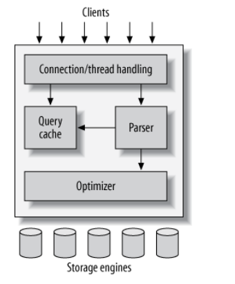
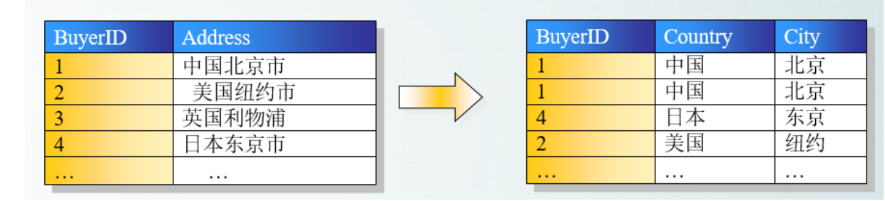
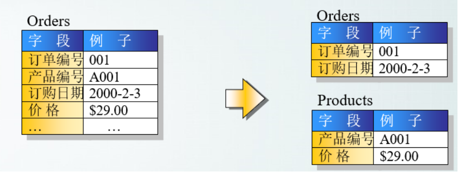
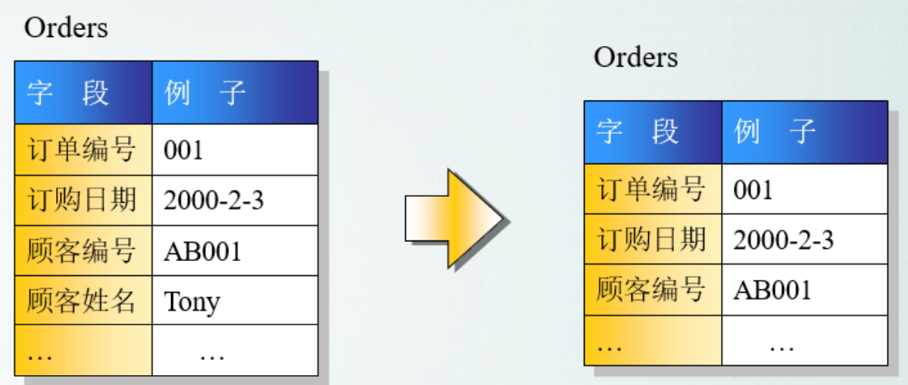

# MySQL架构

## 1.MySQL结构图

 

1. 第一层并不是MySQL独有的，大多数基于网络的C/S服务都有类似的架构。比如：连接处理，授权认证，安全...

2. 第二层是MySQL的核心服务功能。包括查询解析，分析，优化，缓存以及所有的内置函数。

   所有跨存储引擎的功能都在这一层实现： 存储过程，触发器。视图(View)

3. 第三层是存储引擎。负责MySQL中数据的存储和提取。服务器通过API与存储引擎进行通信。

# 分布式锁的实现方式
1. 可以使用数据库的乐观锁实现
2. 使用redis的setnx()、expire()方法，用于分布式锁
3. 基于Zookeeper实现分布式锁

## 2. 数据库的范式
> 第一范式 

第一范式的目标是确保每列的原子性：每列都是不可再分的最小单元(也称为最小原子单元); 

> 第二范式

满足第一范式，且表中的非主键不存在对主键的部分依赖。第二范式要求每个表只描述一件事。

> 第三范式

满足第二范式，且列表中的列不存在对**非主键**的传递依赖。

# 3. MySQL事务

## 3.1 事务隔离级别

SQL标准中定义了四种隔离级别，每一种级别都规定了一个事务中所做的修改，哪些在事务内和事务间是可见的，哪些是不可见的。

较低级别的通常可以执行更高的并发，系统的开销也低

> 1. read uncommitted 未提交读

在该级别中，事务中的修改，即使没有提交，对其他事务也是可见的。事务可以读取未提交的数据，这也称之为【脏读】(Dirty Read)。这个级别会导致很多问题，且在性能上 READ UNCOMMIT不会比其他的级别好，因此在实际应用中很少使用该隔离级别。

> 2. read committed | nonrepeatable read

这是大多数数据库系统默认的隔离级别【MySQL不是】。该事务隔离级别满足事务隔离性的简单定义：一个事务开始时，只能看见已经提交的事务所作的修改。也就是说，一个事务从开始到提交之前，所做的任何修改对其他事务时不可见的。因此这个隔离级别也叫 nonrepeatable read, 因为两次执行同样的查询，可能会得到不一样的结果。

> 3. repeatable read

该级别时MySQL默认事务的隔离级别。解决了脏读的问题。该级别保证了在同一个事务中多此读取同样记录的结果是一致的，但是repeatable read ==不能解决【幻读】的问题==。幻读就是指，当某个事务在读取某个范围内的记录时，另一个事务又在该范围内插入了新的记录，当之前的事务再次读取某个范围内的记录时，会产生幻行。

InnoDB和XtraDB存储引擎通过**多版本并发控制(MVCC, Multiversion Concurrency Control)**来解决幻读的问题

> 4. SERIALIZABLE 

这是最高的隔离级别，它通过强制事务串行执行，避免了幻读的问题。serializable会在**读取**的每一行数据上都加锁。所以可能导致大量的超时和锁争用问题。实际应用中很少用到这个级别，只有在非常需要确保数据的一致性，且没有并发的情况下，才考虑使用这种级别的隔离方式。

事务隔离级别

| 隔离级别                                | 避免脏读           | 避免不可重复读     | 避免幻读           |
| --------------------------------------- | ------------------ | ------------------ | ------------------ |
| read uncommitted                        | :x:                | :x:                | :x:                |
| read committed  nonrepeatable read | :heavy_check_mark: | :x:                | :x:                |
| repeatable read                         | :heavy_check_mark: | :heavy_check_mark: | :x:                |
| serializable                            | :heavy_check_mark: | :heavy_check_mark: | :heavy_check_mark: |

## 3.2 

## 4. MySQL死锁

死锁是指两个或者多个事务在同一个资源上相互占用，并请求锁定对方已经占用的资源，从而导致恶性循环的现象。

1. 当多个事务以不同的顺序锁定资源时，就会产生死锁
2. 多个事务同时锁定同一个资源时，也会产生死锁。

InnoDB目前处理死锁的方式是，将持有最少行级排他锁的事务进行回滚。

# 5. MVCC 多版本并发控制

MVCC是行级锁的一种变体，但是多数情况下避免了加锁操作，因此开销耕地，但大都实现了非阻塞的读操作，写操作只是锁定了必要的行。

MVCC的实现是通过保存数据在某个时间点的快照来实现的。也就是说，不管需要执行多长时间，每个事务看到的数据都是一致的。根据事务开始时间的不同，每个事务对同一张表，同一时刻看到的数据可能不一样。

InnoDB实现MVCC的方式是：通过在每行记录后保存两个隐藏的列来实现。这两个列分别是行的创建版本号和行的过期版本号。是创建或修改该行数据的事务版本号，该版本号由系统生成(system version number).每一开始一个新的事务，系统版本号会自动递增，事务开始时刻的版本号作为事务的版本号，用来和查询到的每行记录的版本号进行比较。

在repretable read的隔离级别下， MVCC的具体操作：

SELECT: InnoDB会根据两个条件检查每行记录

1. InnoDB只是查找**小于**当前事务版本的数据行，也即行的系统版本号小于或等于事务的系统版本号。这样可以确保事务读取的行，要么是事务开始前已经存在的，要么是当前事务自己修改的。
2. 行的删除版本要么未定义，要么**大于**当前的版本号。可以确保事务读取到的行，在事务开始之前未被删除

只有符合上述两条记录，才能返回作为查询的结果

INSERT: InnoDB为新插入的每一行保存当前系统版本号作为行的创建版本号

DELETE: InnoDB为删除的每一行保存当前系统版本号作为行的过期版本号

UPDATE：InnoDB为插入一个新纪录，保存当前系统版本号作为行的创建版本号，原来的行过期版本号设置为当前事务的版本号。

# 6. 索引

索引可以包含一个或多个值。如果索引包含多个列，那么列的顺序也十分重要，因为mysql只能高效地使用索引的【最左前缀列】。创建一个包含两个列的索引，和创建两个只包含一列索引是大不相同的。

## 6.1 索引类型

在mysql中，索引是在存储引擎层实现的。所以，并没有统一的索引标准：不同存储引擎的索引的工作方式并不一样，也不是所有的存储引擎都支持所有类型的索引。即使多个索引引擎支持同一种类型的索引，其底层的实现也可能不同。

> B-Tree 索引

1. B-Tree索引，它使用B-tree数据结构来存储结构。大多数MySQL引擎都支持这种索引。InnoDB使用的是B+Tree。

2. B-Tree通常意味着所有的值都是按顺序存储的，并且每一个叶子页到根的距离相同。

3. B-Tree索引能够加快访问数据的访问，因为存储引擎不再需要进行全表扫描来获取需要的数据，取而代之的是从索引的根结点开始进行搜索。根结点的槽中存放了指向子节点的指针，存储引擎根据这些指针向下层查找。

4. 可以使用B-Tree索引的查询类型。B-Tree 索引适用于**全键值，键值范围或键前缀查找**。其中，键前缀查找只适用于根据**最左前缀**的查找。**索引对如下类型的查询有效**：

   1. **全值匹配**

      全值匹配指的是和索引中的所有列进行匹配，例如 索引可以用于查找姓名为Cuba Allen, 出生于1960-01-01的人。

   2. **匹配最左前缀**

      从最左优先，在数据库进行数据检索时从【联合索引】的最左端开始，只使用索引的第一列。

   3. **匹配列前缀**

   4. **匹配范围值**

   5. **精确匹配某一列并范围匹配另外一列**

> 哈希索引

1. 哈希索引(hash index)基于哈希表现，只有精确匹配索引所有列的查询才有效。对于每一行数据，存储引擎都会对所有的索引列计算一个哈希码(hash code)，哈希码是一个较小的值，并且不同键值的行计算出来的哈希码也不一样。
2. 哈希索引将所有的哈希码存储在索引中，同时在哈希表中保存指向每个数据行的指针。

