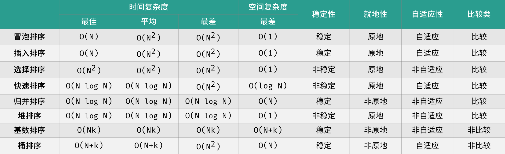

<center><h1>排序算法</h1></center>

> 本文参考： https://leetcode.cn/circle/article/Gwd1Z5/
>
> :hugs: ​感谢K神的分享

# 1. 概述


整数排序： 对于一个整数数组，我们希望将所有数字从小到大排序；
字符串排序： 对于一个姓名列表，我们希望将所有单词按照字符先后排序；
自定义排序： 对于任意一个 已定义比较规则 的集合，我们希望将其按规则排




# 1. 堆排序

```python
#构建大顶堆
def heapify(arr,n,i):
　　largest=i # 索引 i 作为比较的节点索引位置
　　l=2 * i + 1 #left=2*i+1
　　r=2 * (i + 1)  #right=2i+1
　　#由左到右：节点值与下级左右节点值比较
　　#节点 i 小于子左节点值，再用子左节点值与右节点值比较
　　if l < n and arr[i] < arr[l]: #">"由大到小排序；"<"有小到大排序
　　　　largest=l #如果子左节点值大，则用子左节点值与子右节点值比较
　　if r < n and arr[largest] < arr[r]: #">"由大到小排序；"<"有小到大排序
　　　　largest = r #
　　if largest != i: #如果发现 i 节点值比左右子节点值小，则把做大的子节点值与 i 位置的值交换，实现大顶堆的性质。
　　　　arr[i], arr[largest] = arr[largest], arr[i] #交换
　　　　heapify(arr, n, largest) #然后 递归此过程


def heapSort(arr):
　　n=len(arr)
　　#从下往上构建大顶堆
　　for i in range(n,-1,-1): # i 从取最大位置索引开始
　　　　heapify(arr,n,i)
　　#一个个交换元素
　　#大顶堆构建完成后，跟节点值与最后节点值交换,最大值放到了列表的最后
　　#然后再从根节点索引位置开始，再次进行大顶堆的构建
　　#再把跟节点值与 i 索引的值交换，依次递归
　　for i in range(n-1,0,-1): # i ：数列元素的个数逐渐减少
　　　　arr[i],arr[0]=arr[0],arr[i] #交换
　　　　heapify(arr,i,0) #从根节点开始从已构建的大顶堆再次重构
```

# 2. 快速排序

> 代码实现

```python

def sort(arr: list):
    quickSort(arr, 0, len(arr) - 1)


def quickSort(arr: list, left: int, right: int):
    if left >= right:
        return
    i = left
    j = right
    while i < j:
        while i < j and arr[j] >= arr[left]:
            j -= 1
        while i < j and arr[i] <= arr[left]:
            i += 1
        arr[i], arr[j] = arr[j], arr[i]
    arr[i], arr[left] = arr[left], arr[i]
    quickSort(arr, left, i - 1)
    quickSort(arr, i + 1, right)
```


