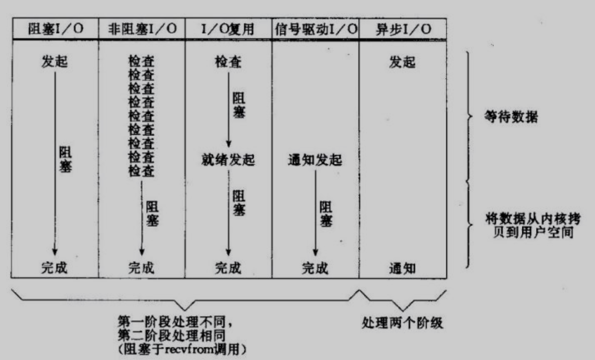

<h1>
    <center>IO模型</center>
</h1>
> 本文参考：
>
> 1. https://mp.weixin.qq.com/s/T-hP3wt4whtvVh1H1LBU3w
> 2. 

# 1. 基本概念

IO模型就是说用什么样的通道进行数据的发送和接收，Java 共支持3中网络编程 IO 模式：BIO、NIO、AIO。Java 中的 BIO、NIO 和 AIO 理解为是 Java 语言对操作系统的各种 IO 模型的封装。我们在使用这些 API 的时候，不需要关心操作系统层面的知识，也不需要根据不同操作系统编写不同的代码。

在讲 BIO、NIO、AIO 之前先回顾几个概念：同步与异步、阻塞与非阻塞、I/O模型。

### 同步与异步

- **同步**：同步就是发起一个调用后，被调用者未处理完请求之前，调用不返回。
- **异步**：异步就是发一个调用后，立刻得到被调用者的回应表示已接收到请求，但是被调用者并没有返回结果，此时可以处理其他的请求，被调用者通常依靠事件、回调等机制来通知调用者其返回结果。

同步和异步的区别最大在于异步的话调用者不需要等待结果处理，被调用者会通过回调等机制来通知调用者返回结果。

### 阻塞和非阻塞

- **阻塞**：阻塞就是发起一个请求，调用者一直等待请求结果返回，也就是当前线程会被挂起，无法从事其他任务，只有当条件就绪才能继续。
- **非阻塞**：非阻塞就是发起一个请求，调用者不用一直等着结果返回，可以先去干其他的事情。

### 例子

**老张烧开水的故事（故事来源网络）**

老张爱喝茶，废话不说，煮开水。

出场人物：老张，水壶两把（普通水壶，简称水壶；会响的水壶，简称响水壶）。

1. 老张把水壶放到火上，立等水开。（**同步阻塞**）
2. 老张把水壶放到火上，去客厅看电视，时不时去厨房看看水开没有。（**同步非阻塞**）
3. 老张把响水壶放到火上，立等水开。（**异步阻塞**）
4. 老张把响水壶放到火上，去客厅看电视，水壶响之前不再去看它了，响了再去拿壶。（**异步非阻塞**）

> **所谓同步异步，只是对于水壶(调用函数)而言**
>
> - 普通水壶：同步；响水壶：异步。
> - 虽然都能干活，但响水壶可以在自己完工之后，提示老张水开了，这是普通水壶所不能及的。
> - 同步只能让调用者去轮询自己（情况2中），造成老张效率的低下。

> **所谓阻塞非阻塞，仅仅对于老张(线程)而言**
>
> - 立等的老张：阻塞；看电视的老张：非阻塞。
> - 情况1 和 情况3 中老张就是阻塞的，媳妇喊他都不知道。虽然情况3中响水壶是异步的，可对于立等的老张没有太大的意义。所以一般异步是配合非阻塞使用的，这样才能发挥异步的效用。

### 常见的 I/O 模型对比

所有的系统 I/O 都分为两个阶段：【等待数据】 和 【将数据从内核拷贝到用户空间】。

举例来说，读函数，分为等待系统可读和真正的读；同理，写函数分为等待网卡可以写和真正的写。

需要说明的是等待就绪的阻塞是不使用 CPU 的，是在“空等”；而真正的读操作的阻塞是使用 CPU 的，真正在“干活”，而且这个过程非常快，属于 memory copy，带宽通常在 1GB/s 级别以上，可以理解为基本不耗时。

如下几种常见 I/O 模型的对比：



**以socket.read()为例子**：

- 传统的BIO里面socket.read()，如果TCP RecvBuffer里没有数据，函数会一直阻塞，直到收到数据，返回读到的数据。
- 对于NIO，如果TCP RecvBuffer有数据，就把数据从网卡读到内存，并且返回给用户；反之则直接返回0，永远不会阻塞。
- AIO(Async I/O)里面会更进一步：不但等待就绪是非阻塞的，就连数据从网卡到内存的过程也是异步的。

**换句话说，BIO里用户最关心“我要读”，NIO里用户最关心"我可以读了"，在AIO模型里用户更需要关注的是“读完了”。**

> NIO一个重要的特点是：socket主要的读、写、注册和接收函数，在等待就绪阶段都是非阻塞的，真正的I/O操作是同步阻塞的（消耗CPU但性能非常高）。


---


# 2. **BIO（Blocking I/O）**

同步阻塞 I/O 模式，数据的读取写入必须阻塞在一个线程内等待其完成（一个客户端连接对于一个处理线程）。BIO通信（一请求一应答）模型图如下(图源网络)：

 

采用 **BIO 通信模型** 的服务队，通常由一个独立的 `Acceptor` 线程负责监听客户端的连接。我们一般通过在 `while(true)` 循环中服务端会调用 `accept()` 方法等待客户端连接的方式监听请求，请求一旦接收到一个连接请求，就可以建立通信套接字在这个通信套接字上进行读写操作，此时不能再接收其他客户端连接请求，只能等待当前连接的客户端的操作执行完成，不过可以通过多线程来支持多个客户端的连接，如上图所示(即：一个客户端一个服务端线程)。

如果要让 **BIO 通信模型** 能够同时处理多个客户端的请求，就必须使用**多线程**（要原因是 `socket.accept()`、 `socket.read()`、 `socket.write()` 涉及的三个主要函数都是同步阻塞的），当一个连接在处理 I/O 的时候，系统是阻塞的，如果是单线程的必然就挂死在那里。开启多线程，就可以让CPU去处理更多的事情。也就是说它在接收到客户端连接请求之后**为每个客户端创建一个新的线程进行链路处理**，处理完成之后，通过输出流返回给客户端，线程销毁。这就是典型的 **一请求一应答通信模型**。

其实这也是所有使用多线程的本质：

- 利用多核
- 当 I/O 阻塞系统，但 CPU 空闲的时候，可以利用多线程使用 CPU 资源。

> 我们可以设想以下如果连接不做任何的事情的话就会造成不必要的线程开销，不过可以通过 线程池机制 改善，线程池还可以让线程的创建和回收成本相对较低。例如使用FixedTreadPool 可以有效的控制来线程的最大数量，保证来系统有限的资源的控制，实现了N（客户端请求数量）：M（处理客户端请求的线程数量）的伪异步I/O模型（N可以远远大于M）。

:bug: 当客户端并发访问量增加后这种模型会出什么问题？ 

随着并发访问量增加会导致线程数急剧膨胀,可能会导致线程堆栈溢出、创建新线程失败等问题，最终导致进程宕机或者僵死，不能对外提供服务。

### 伪异步 I/O

> 使用线程词来管理多个线程，本质上还是阻塞IO

为了解决同步阻塞I/O面临的一个链路需要一个线程处理的问题，后来有人对它的线程模型进行了优化：后端通过一个线程池来处理多个客户端的请求接入，形成客户端个数M：线程池最大线程数N的比例关系，其中M可以远远大于N.通过线程池可以灵活地调配线程资源，设置线程的最大值，防止由于海量并发接入导致线程耗尽。

伪异步IO模型图(图源网络)

 

采用线程池和任务队列可以实现一种叫做伪异步的 I/O 通信框架，它的模型图如上图所示。当有新的客户端接入时，将客户端的 Socket 封装成一个Task（该任务实现java.lang.Runnable接口）投递到后端的线程池中进行处理，JDK 的线程池维护一个消息队列和 N 个活跃线程，对消息队列中的任务进行处理。由于线程池可以设置消息队列的大小和最大线程数，因此，它的资源占用是可控的，无论多少个客户端并发访问，都不会导致资源的耗尽和宕机。

> 伪异步I/O通信框架采用了线程池实现，因此避免了为每个请求都创建一个独立线程造成的线程资源耗尽问题。不过因为它的底层任然是同步阻塞的BIO模型，因此无法从根本上解决问题。

### 缺点

1. **IO** 代码里 `read` 操作是阻塞操作，如果连接不做数据读写操作会导致线程阻塞，浪费资源；
2. 如果线程很多，会导致服务器线程太多，压力太大。

### 应用场景

BIO 方式适用于连接数目比较小且固定的架构，这种方式对服务器资源要求比较高，但程序简单理解。

### BIO 代码示例

> 服务端

```java
import java.io.IOException;
import java.net.ServerSocket;
import java.net.Socket;

publicclass SocketServer {
    public static void main(String[] args) throws IOException {
        ServerSocket serverSocket = new ServerSocket(9000);
        while (true) {
            System.out.println("等待连接。。");
            //阻塞方法
            final Socket socket = serverSocket.accept();
            System.out.println("有客户端连接了。。");

            // 多线程处理
            new Thread(new Runnable() {
                @Override
                public void run() {
                    try {
                        handler(socket);
                    } catch (IOException e) {
                        e.printStackTrace();
                    }
                }
            }).start();

            // 单线程处理
            //handler(socket);

        }
    }

    private static void handler(Socket socket) throws IOException {
        System.out.println("thread id = " + Thread.currentThread().getId());
        byte[] bytes = newbyte[1024];

        System.out.println("准备read。。");
        //接收客户端的数据，阻塞方法，没有数据可读时就阻塞
        int read = socket.getInputStream().read(bytes);
        System.out.println("read完毕。。");
        if (read != -1) {
            System.out.println("接收到客户端的数据：" + new String(bytes, 0, read));
            System.out.println("thread id = " + Thread.currentThread().getId());

        }
        socket.getOutputStream().write("HelloClient".getBytes());
        socket.getOutputStream().flush();
    }
}
```

> 客户端

```java
import java.io.IOException;
import java.net.Socket;

publicclass SocketClient {
    public static void main(String[] args) throws IOException {
        Socket socket = new Socket("127.0.0.1", 9000);
        //向服务端发送数据
        socket.getOutputStream().write("HelloServer".getBytes());
        socket.getOutputStream().flush();
        System.out.println("向服务端发送数据结束");
        byte[] bytes = newbyte[1024];
        //接收服务端回传的数据
        socket.getInputStream().read(bytes);
        System.out.println("接收到服务端的数据：" + new String(bytes));
        socket.close();
    }
}
```

# 3. **NIO（Non Blocking IO）**

同步非阻塞，**服务器实现模式为一个线程可以处理多个请求（连接）**，客户端发送的连接请求都会注册到 **多路复用器 selector** 上，多路复用器轮询到连接有 IO 请求就进行处理。

它支持面向缓冲的，基于通道的I/O操作方法。NIO提供了与传统BIO模型中的 `Socket` 和 `ServerSocket` 相对应的 `SocketChannel` 和 `ServerSocketChannel` 两种不同的套接字通道实现，两种通道都支持阻塞和非阻塞两种模式。

- 阻塞模式使用就像传统中的支持一样，比较简单，但是性能和可靠性都不好；
- 非阻塞模式正好与之相反。

> 对于低负载、低并发的应用程序，可以使用同步阻塞I/O来提升开发速率和更好的维护性； 对于高负载、高并发的（网络）应用，应使用 NIO 的非阻塞模式来开发。

### NIO核心组件

NIO 有三大核心组件, 整个NIO体系包含的类远远不止这三个，只能说这三个是NIO体系的“核心API”。

- **Channel**（**通道**）
- **Buffer**（**缓冲区**）
- **Selector**（**选择器**）

 

1. channel 类似于流，每个 channel 对应一个 buffer 缓冲区，buffer 底层就是个数组；
2. channel 会注册到 selector 上，由 selector 根据 channel 读写事件的发生将其交由某个空闲的线程处理；
3. selector 可以对应一个或多个线程
4. NIO 的 Buffer 和 channel 既可以读也可以写

### NIO的特性

我们从一个问题来总结：

:grey_question:**NIO 与 IO 的区别**？

如果是在面试中来回答这个问题，我觉得首先肯定要从 NIO 流是非阻塞的，而 IO 流是阻塞的说起。然后可以从 NIO 的3个核心组件/特性为 NIO 带来的一些改进来分析。

> 1. IO流是阻塞的，NIO流不是阻塞的

Java NIO 使我们可以进行非阻塞 IO 操作。比如说，单线程中从通道读取数据到 buffer，同时可以继续做别的事情，当数据读取到 buffer 中后，线程再继续处理数据。写数据也是一样的。另外，非阻塞写也是日常，一个线程请求写入一些数据到某通道，但不需要等待它完全写入，这个线程同时可以去做别的事情。

Java IO 的各种流是阻塞的，这意味这，当一个线程调用 read() 或 write() 时，该线程被阻塞，直到有一些数据被读取或数据完全写入。该线程在此期间不能再干任何事情了。

> 2. IO 面向流（Stream oriented），NIO 面向缓冲区（Buffer oriented）

Buffer 是一个对象，它包含一些要写入或者要读出的数据。在 NIO 类库中加入 Buffer对象，体现了新库与原库 I/O的一个重要区别：

- 在面向流的 I/O 中，可以直接将数据写入或者将数据直接读到 Stream 对象中。虽然 Stream 中也有 Buffer 开通的扩展类，但只是流的包装类，还从流读到缓冲区。
- NIO 是直接读到 Buffer 中再进行操作。在 NIO 库中，所有的数据都是用缓冲区处理的。在读取数据时，它是直接读到缓冲区中的；在写入数据时，写入到缓存中。任何时候访问 NIO 中的数据，都是通过缓冲区进行操作。

最常用的缓冲区是 ByteBuffer，ByteBuffer 提供流一组功能用于操作 byte 数组。除了 ByteBuffer 还有其他的一些缓冲区，事实上，每一种 Java 基本类型（除了 Boolean 类型）都对应有一种缓冲区。

> 3. NIO 通过 Channel（通道）进行读写

**Channel（通道）**

通道是双向的，可读也可以写，而流的读写是单向的。

无论读写，通道只能和 Buffer 交互。因为 Buffer，通道可以异步地读写。

> 4. NIO 有选择器，而 IO 没有

**Selectors（选择器）**

选择器用于使用单线程处理多个通道。因此，它需要较少的线程来处理这些通道。线程之间的切换对于操作系统来说是昂贵的。因此，为了提供系统效率选择器是有用的。

### NIO 读数据和写数据

通常来说 NIO 中的所有 IO 都是从 Channel（通道）开始的。

- 从通道进行数据读取：创建一个缓冲区，然后请求通道读取数据；
- 从通道进行数据写入：创建一个缓冲区，填充数据，并要求通道写入数据。

### 缺点

对于非阻塞IO就有一个非常严重的问题，在while循环中需要不断地去询问内核数据是否就绪，这样会导致CPU占用率非常高，因此一般情况下很少使用while循环这种方式来读取数据。

### 应用场景

NIO 方式适用于连接数目多且连接比较短（轻操作）的架构，比如聊天服务器、弹幕系统、服务器间通讯、编程比较复杂。

### NIO 代码示例

> 服务端

```java
import java.io.IOException;
import java.net.InetSocketAddress;
import java.nio.ByteBuffer;
import java.nio.channels.SelectionKey;
import java.nio.channels.Selector;
import java.nio.channels.ServerSocketChannel;
import java.nio.channels.SocketChannel;
import java.util.Iterator;

publicclass NIOServer {

    //public static ExecutorService pool = Executors.newFixedThreadPool(10);

    public static void main(String[] args) throws IOException {
        // 创建一个在本地端口进行监听的服务Socket通道.并设置为非阻塞方式
        ServerSocketChannel ssc = ServerSocketChannel.open();
        //必须配置为非阻塞才能往selector上注册，否则会报错，selector模式本身就是非阻塞模式
        ssc.configureBlocking(false);
        ssc.socket().bind(new InetSocketAddress(9000));
        // 创建一个选择器selector
        Selector selector = Selector.open();
        // 把ServerSocketChannel注册到selector上，并且selector对客户端accept连接操作感兴趣
        ssc.register(selector, SelectionKey.OP_ACCEPT);

        while (true) {
            System.out.println("等待事件发生。。");
            // 轮询监听channel里的key，select是阻塞的，accept()也是阻塞的
            int select = selector.select();

            System.out.println("有事件发生了。。");
            // 有客户端请求，被轮询监听到
            Iterator<SelectionKey> it = selector.selectedKeys().iterator();
            while (it.hasNext()) {
                SelectionKey key = it.next();
                //删除本次已处理的key，防止下次select重复处理
                it.remove();
                handle(key);
            }
        }
    }

    private static void handle(SelectionKey key) throws IOException {
        if (key.isAcceptable()) {
            System.out.println("有客户端连接事件发生了。。");
            ServerSocketChannel ssc = (ServerSocketChannel) key.channel();
            //NIO非阻塞体现：此处accept方法是阻塞的，但是这里因为是发生了连接事件，所以这个方法会马上执行完，不会阻塞
            //处理完连接请求不会继续等待客户端的数据发送
            SocketChannel sc = ssc.accept();
            sc.configureBlocking(false);
            //通过Selector监听Channel时对读事件感兴趣
            sc.register(key.selector(), SelectionKey.OP_READ);
        } elseif (key.isReadable()) {
            System.out.println("有客户端数据可读事件发生了。。");
            SocketChannel sc = (SocketChannel) key.channel();
            ByteBuffer buffer = ByteBuffer.allocate(1024);
            //NIO非阻塞体现:首先read方法不会阻塞，其次这种事件响应模型，当调用到read方法时肯定是发生了客户端发送数据的事件
            int len = sc.read(buffer);
            if (len != -1) {
                System.out.println("读取到客户端发送的数据：" + new String(buffer.array(), 0, len));
            }
            ByteBuffer bufferToWrite = ByteBuffer.wrap("HelloClient".getBytes());
            sc.write(bufferToWrite);
            key.interestOps(SelectionKey.OP_READ | SelectionKey.OP_WRITE);
        } elseif (key.isWritable()) {
            SocketChannel sc = (SocketChannel) key.channel();
            System.out.println("write事件");
            // NIO事件触发是水平触发
            // 使用Java的NIO编程的时候，在没有数据可以往外写的时候要取消写事件，
            // 在有数据往外写的时候再注册写事件
            key.interestOps(SelectionKey.OP_READ);
            //sc.close();
        }
    }
}
```


**NIO服务端程序详细分析**：

1. 创建一个 ServerSocketChannel 和 Selector ，并将 ServerSocketChannel 注册到 Selector 上；
2. Selector 通过 select() 方法监听 channel 事件，当客户端连接时，selector 监听到连接事件，获取到 ServerSocketChannel 注册时绑定的 selectionKey；
3. selectionKey 通过 channel() 方法可以获取绑定的 ServerSocketChannel；
4. ServerSocketChannel 通过 accept() 方法得到 SocketChannel;
5. 将 SocketChannel  注册到 Selector 上，关心 read 事件；
6. 注册后返回一个 SelectionKey，会和该 SocketChannel 关联；
7. Selector 继续通过 select() 方法监听事件，当客户端发送数据给服务端，Selector 监听到 read 事件，获取到 SocketChannel 注册时绑定的 SelectionKey;
8. SelectionKey 通过 channel() 方法可以获取绑定的 socketChannel;
9. 将 socketChannel 里的数据读取出来；
10. 用 socketChannel 将服务端数据写回客户端。

> 客户端

```java
import java.io.IOException;
import java.net.InetSocketAddress;
import java.nio.ByteBuffer;
import java.nio.channels.SelectionKey;
import java.nio.channels.Selector;
import java.nio.channels.SocketChannel;
import java.util.Iterator;

publicclass NioClient {
    //通道管理器
    private Selector selector;

    /**
     * 启动客户端测试
     *
     * @throws IOException
     */
    public static void main(String[] args) throws IOException {
        NioClient client = new NioClient();
        client.initClient("127.0.0.1", 9000);
        client.connect();
    }

    /**
     * 获得一个Socket通道，并对该通道做一些初始化的工作
     *
     * @param ip   连接的服务器的ip
     * @param port 连接的服务器的端口号
     * @throws IOException
     */
    public void initClient(String ip, int port) throws IOException {
        // 获得一个Socket通道
        SocketChannel channel = SocketChannel.open();
        // 设置通道为非阻塞
        channel.configureBlocking(false);
        // 获得一个通道管理器
        this.selector = Selector.open();

        // 客户端连接服务器,其实方法执行并没有实现连接，需要在listen（）方法中调
        //用channel.finishConnect() 才能完成连接
        channel.connect(new InetSocketAddress(ip, port));
        //将通道管理器和该通道绑定，并为该通道注册SelectionKey.OP_CONNECT事件。
        channel.register(selector, SelectionKey.OP_CONNECT);
    }

    /**
     * 采用轮询的方式监听selector上是否有需要处理的事件，如果有，则进行处理
     *
     * @throws IOException
     */
    public void connect() throws IOException {
        // 轮询访问selector
        while (true) {
            selector.select();
            // 获得selector中选中的项的迭代器
            Iterator<SelectionKey> it = this.selector.selectedKeys().iterator();
            while (it.hasNext()) {
                SelectionKey key = (SelectionKey) it.next();
                // 删除已选的key,以防重复处理
                it.remove();
                // 连接事件发生
                if (key.isConnectable()) {
                    SocketChannel channel = (SocketChannel) key.channel();
                    // 如果正在连接，则完成连接
                    if (channel.isConnectionPending()) {
                        channel.finishConnect();
                    }
                    // 设置成非阻塞
                    channel.configureBlocking(false);
                    //在这里可以给服务端发送信息哦
                    ByteBuffer buffer = ByteBuffer.wrap("HelloServer".getBytes());
                    channel.write(buffer);
                    //在和服务端连接成功之后，为了可以接收到服务端的信息，需要给通道设置读的权限。
                    channel.register(this.selector, SelectionKey.OP_READ);                                            // 获得了可读的事件
                } else if (key.isReadable()) {
                    read(key);
                }
            }
        }
    }

    /**
     * 处理读取服务端发来的信息 的事件
     *
     * @param key
     * @throws IOException
     */
    public void read(SelectionKey key) throws IOException {
        //和服务端的read方法一样
        // 服务器可读取消息:得到事件发生的Socket通道
        SocketChannel channel = (SocketChannel) key.channel();
        // 创建读取的缓冲区
        ByteBuffer buffer = ByteBuffer.allocate(1024);
        int len = channel.read(buffer);
        if (len != -1) {
            System.out.println("客户端收到信息：" + new String(buffer.array(), 0, len));
        }
    }
}
```

### 总结

1. NIO 模型的 selector 就像一个大总管，负责监听各种 I/O 事件，然后转交给后端线程去处理。
2. NIO 相对于 BIO 非阻塞的体现就在：BIO 的后端线程需要阻塞等待客户端写数据（比如 read 方法），如果客户端不写数据线程就要阻塞。
3. NIO 把等到客户端操作的时候交给了大总管 selector ，selector 负责轮询所有已注册的客户端，发现有事件发生了才转交给后端线程处理，后端线程不需要做任何阻塞等待，直接处理客户端事件的数据即可，处理完马上结束，或返回线程池供其他客户端事件继续使用。
4. channel 的读写是非阻塞的。

> Redis 就是典型的 NIO 线程模型，selector 收集所有的事件并且转给后端线程，线程连续执行所有事件命令并将结果写回客户端。

# 4. IO多路复用

所谓 I/O 多路复用机制，就是说通过一种机制，可以监视多个描述符，一旦某个描述符就绪（一般是读就绪或写就绪），能够通知程序进行相应的读写操作。这种机制的使用需要 `select` 、 `poll` 、 `epoll` 来配合。

在多路复用IO模型中，会有一个内核线程不断地去轮询多个 socket 的状态，只有当真正读写事件发送时，才真正调用实际的IO读写操作。因为在多路复用IO模型中，只需要使用一个线程就可以管理多个socket，系统不需要建立新的进程或者线程，也不必维护这些线程和进程，并且只有真正有读写事件进行时，才会使用IO资源，所以它大大减少来资源占用。


- IO复用模式是使用select或者poll函数向系统内核发起调用，阻塞在这两个系统函数调用，而不是真正阻塞于实际的IO操作(recvfrom调用才是实际阻塞IO操作的系统调用)
- 阻塞于select函数的调用,等待数据报套接字变为可读状态
- 当select套接字返回可读状态的时候,就可以发起recvfrom调用把数据报复制到用户空间的缓冲区

# 5. 信号驱动IO

在信号驱动IO模型中，当用户线程发起一个IO请求操作，会给对应的socket注册一个信号函数，然后用户线程会继续执行，当内核数据就绪时会发送一个信号给用户线程，用户线程接收到信号后，便在信号函数中调用IO读写操作来进行实际的IO请求操作。这个一般用于UDP中，对TCP套接字几乎没用，原因是该信号产生得过于频繁，并且该信号的出现并没有告诉我们发生了什么请求。


用户进程可以使用信号方式，当系统内核描述符就绪时将会发送SIGNO给到用户空间，这个时候再发起recvfrom的系统调用等待返回成功提示，流程如下：

- 先开启套接字的信号IO启动功能，并通过一个内置安装信号处理函数的signaction系统调用，当发起调用之后会直接返回；
- 其次，等待内核从网络中接收数据报之后，向用户空间发送当前数据可达的信号给信号处理函数；
- 信号处理函数接收到信息就发起recvfrom系统调用等待内核数据复制数据报到用户空间的缓冲区；
- 接收到复制完成的返回成功提示之后，应用进程就可以开始从网络中读取数据。


# 6. **AIO（Asynchronous I/O）**

异步非阻塞， 由操作系统完成后回调通知【服务端程序】启动线程去处理， **一般适用于连接数较多且连接时间较长的应用。**

之前提到的BIO, NIO模型实际上都属于同步IO，只有AIO是真正的异步IO，因为无论是多路复用IO还是信号驱动模型，IO操作的第2个阶段都会引起用户线程阻塞，也就是内核进行数据拷贝的过程都会让用户线程阻塞。


AIO 也就是 NIO 2。在 Java 7 中引入了 NIO 的改进版 NIO 2,它是异步非阻塞的IO模型。异步 IO 是基于事件和回调机制实现的，也就是应用操作之后会直接返回，不会堵塞在那里，当后台处理完成，操作系统会通知相应的线程进行后续的操作。

- 由POSIX规范定义，告知系统内核启动某个操作，并让内核在整个操作包含数据等待以及数据复制过程的完成之后通知用户进程数据已经准备完成，可以进行读取数据；

与上述的信号IO模型区分在于异步是通知我们何时IO操作完成,而信号IO是通知我们何时可以启动一个IO操作。

>  AIO 是异步IO的缩写，虽然 NIO 在网络操作中，提供了非阻塞的方法，但是 NIO 的 IO 行为还是同步的。对于 NIO 来说，我们的业务线程是在 IO 操作准备好时，得到通知，接着就由这个线程自行进行 IO 操作，IO操作本身是同步的。（除了 AIO 其他的 IO 类型都是同步的）

### 应用场景

AIO 方式适用于连接数目多且连接比较长（重操作）的架构。

### AIO 代码示例

> 服务端

```java
import java.io.IOException;
import java.net.InetSocketAddress;
import java.nio.ByteBuffer;
import java.nio.channels.AsynchronousServerSocketChannel;
import java.nio.channels.AsynchronousSocketChannel;
import java.nio.channels.CompletionHandler;

publicclass AIOServer {
    public static void main(String[] args) throws Exception {
        final AsynchronousServerSocketChannel serverChannel =
                AsynchronousServerSocketChannel.open().bind(new InetSocketAddress(9000));

        serverChannel.accept(null, new CompletionHandler<AsynchronousSocketChannel, Object>() {
            @Override
            public void completed(final AsynchronousSocketChannel socketChannel, Object attachment) {
                try {
                    // 再此接收客户端连接，如果不写这行代码后面的客户端连接连不上服务端
                    serverChannel.accept(attachment, this);
                    System.out.println(socketChannel.getRemoteAddress());
                    ByteBuffer buffer = ByteBuffer.allocate(1024);
                    socketChannel.read(buffer, buffer, new CompletionHandler<Integer, ByteBuffer>() {
                        @Override
                        public void completed(Integer result, ByteBuffer buffer) {
                            buffer.flip();
                            System.out.println(new String(buffer.array(), 0, result));
                            socketChannel.write(ByteBuffer.wrap("HelloClient".getBytes()));
                        }

                        @Override
                        public void failed(Throwable exc, ByteBuffer buffer) {
                            exc.printStackTrace();
                        }
                    });
                } catch (IOException e) {
                    e.printStackTrace();
                }
            }

            @Override
            public void failed(Throwable exc, Object attachment) {
                exc.printStackTrace();
            }
        });

        Thread.sleep(Integer.MAX_VALUE);
    }
}
```

> 客户端

```java
import java.net.InetSocketAddress;
import java.nio.ByteBuffer;
import java.nio.channels.AsynchronousSocketChannel;

publicclass AIOClient {

    public static void main(String... args) throws Exception {
        AsynchronousSocketChannel socketChannel = AsynchronousSocketChannel.open();
        socketChannel.connect(new InetSocketAddress("127.0.0.1", 9000)).get();
        socketChannel.write(ByteBuffer.wrap("HelloServer".getBytes()));
        ByteBuffer buffer = ByteBuffer.allocate(512);
        Integer len = socketChannel.read(buffer).get();
        if (len != -1) {
            System.out.println("客户端收到信息：" + new String(buffer.array(), 0, len));
        }
    }
}
```

# 7. **BIO、NIO、AIO对比**

|              | **BIO**  | **NIO**                | **AIO**    |
| :----------- | :------- | :--------------------- | ---------- |
| **IO模型**   | 同步阻塞 | 同步非阻塞（多路复用） | 异步非阻塞 |
| **编程难度** | 简单     | 复杂                   | 复杂       |
| **可靠性**   | 差       | 好                     | 好         |
| **吞吐量**   | 低       | 高                     | 高         |

现代计算机服务器操作系统大部分都是基于linxu实现,为处理高并发而采取NIO的模型,对于支持异步IO模型的系统持有不确定因素。