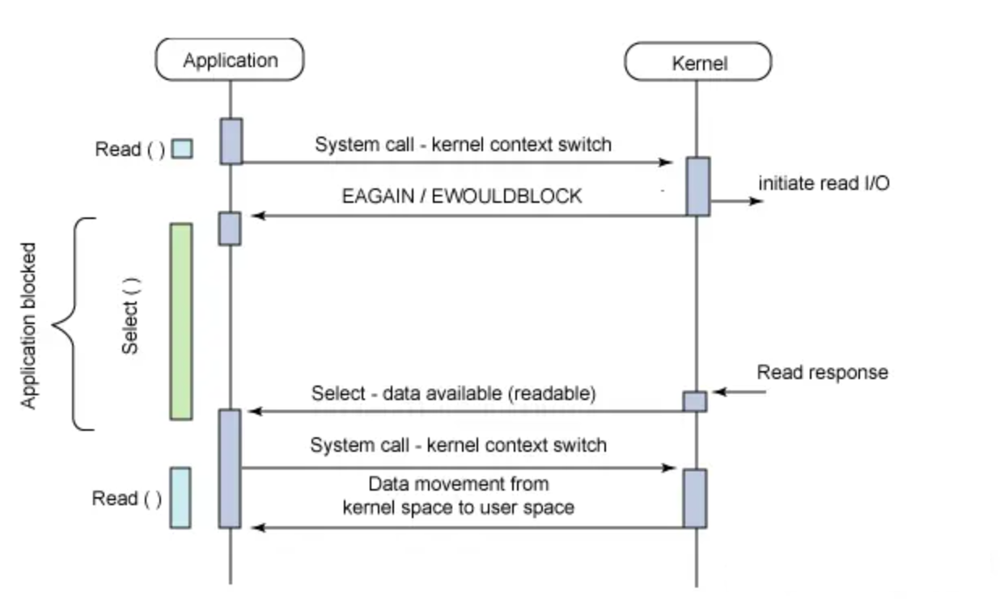
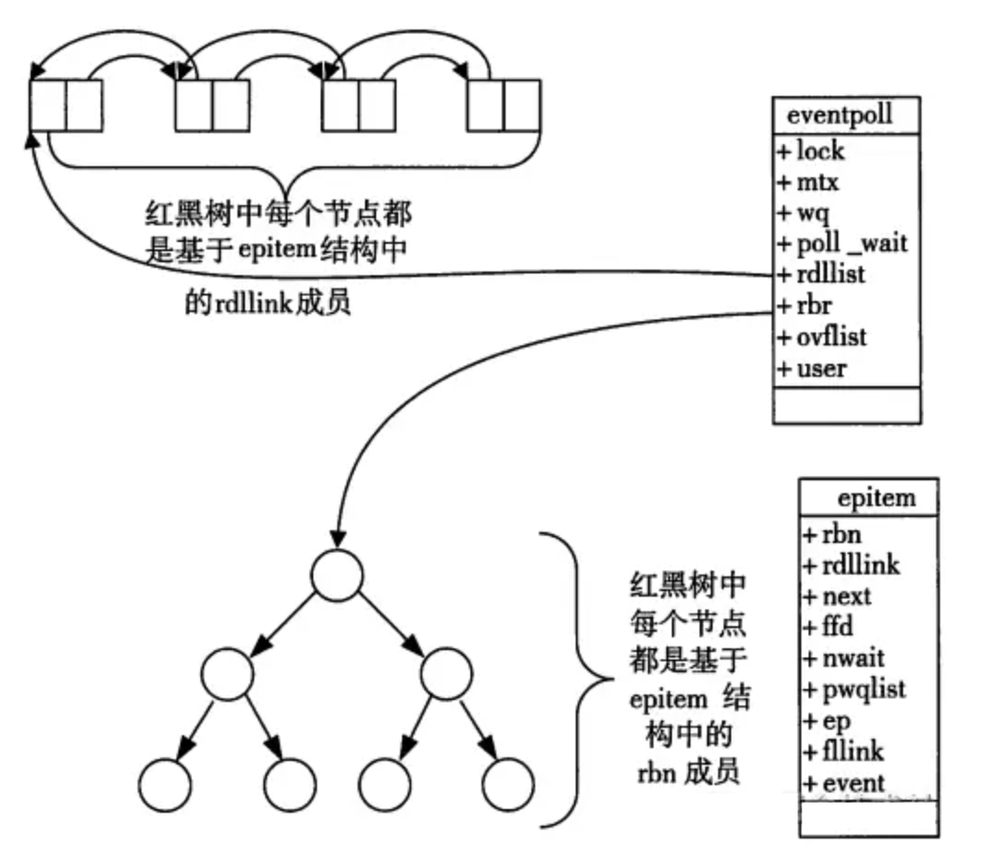

<h1><center>IO多路复用实现</center></h1>

> 本文参考：https://juejin.cn/post/6882984260672847879#heading-7

# 1. 相关概念

IO 多路复用有三种实现，在介绍select、poll、epoll之前，首先介绍一下Linux操作系统中**基础的概念**：

- 用户空间和内核空间
- 进程切换
- 进程的阻塞
- 文件描述符
- 缓存 I/O

### 用户空间 / 内核空间

现在操作系统都是采用虚拟存储器，那么对32位操作系统而言，它的寻址空间（虚拟存储空间）为4G（2的32次方）。 操作系统的核心是内核，独立于普通的应用程序，可以访问受保护的内存空间，也有访问底层硬件设备的所有权限。为了保证用户进程不能直接操作内核（kernel），保证内核的安全，操作系统将虚拟空间划分为两部分，一部分为内核空间，一部分为用户空间。

现在操作系统都是采用虚拟存储器，那么对32位操作系统而言，它的寻址空间（虚拟存储空间）为4G（2的32次方）。 操作系统的核心是内核，独立于普通的应用程序，可以访问受保护的内存空间，也有访问底层硬件设备的所有权限。为了保证用户进程不能直接操作内核（kernel），保证内核的安全，操作系统将虚拟空间划分为两部分，一部分为内核空间，一部分为用户空间。

针对linux操作系统而言，将最高的1G字节（从虚拟地址0xC0000000到0xFFFFFFFF），供内核使用，称为内核空间，而将较低的3G字节（从虚拟地址0x00000000到0xBFFFFFFF），供各个进程使用，称为用户空间。

### 进程切换

为了控制进程的执行，内核必须有能力挂起正在CPU上运行的进程，并恢复以前挂起的某个进程的执行。这种行为被称为进程切换。因此可以说，任何进程都是在操作系统内核的支持下运行的，是与内核紧密相关的，并且进程切换是非常耗费资源的。

从一个进程的运行转到另一个进程上运行，这个过程中经过下面这些变化：

1. 保存处理机上下文，包括程序计数器和其他寄存器。
2. 更新PCB信息。
3. 把进程的PCB移入相应的队列，如就绪、在某事件阻塞等队列。
4. 选择另一个进程执行，并更新其PCB。
5. 更新内存管理的数据结构。
6. 恢复处理机上下文。

### 进程阻塞

正在执行的进程，由于期待的某些事件未发生，如请求系统资源失败、等待某种操作的完成、新数据尚未到达或无新工作做等，则由系统自动执行阻塞原语(Block)，使自己由运行状态变为阻塞状态。可见，进程的阻塞是进程自身的一种主动行为，也因此只有处于运行态的进程（获得了CPU资源），才可能将其转为阻塞状态。当进程进入阻塞状态，是不占用CPU资源的。

### 文件描述符 FD

`文件描述符（File descriptor）`是计算机科学中的一个术语，是一个用于表述指向文件的引用的抽象化概念。 文件描述符在形式上是一个非负整数。实际上，**它是一个索引值**，指向内核为每一个进程打开文件的记录表。当程序打开一个现有文件或者创建一个新文件时，内核向进程返回一个文件描述符。在程序设计中，一些涉及底层的程序编写往往会围绕着文件描述符展开。但是文件描述符这一概念往往只适用于UNIX、Linux这样的操作系统。

### 缓存I/O

缓存I/O又称为标准I/O，大多数文件系统的默认I/O操作都是缓存I/O。在Linux的缓存I/O机制中，操作系统会将I/O的数据缓存在文件系统的页缓存中，即**数据会先被拷贝到操作系统内核的缓冲区中，然后才会从操作系统内核的缓冲区拷贝到应用程序的地址空间。**

>  **缓存 I/O 的缺点**

数据在传输过程中需要在应用程序地址空间和内核进行多次数据拷贝操作，这些数据拷贝操作所带来的 CPU 以及内存开销是非常大的。

# 2. IO多路复用

- IO 多路复用是一种同步IO模型，实现一个线程可以监视多个文件句柄；
- 一旦某个文件句柄就绪，就能够通知应用程序进行相应的读写操作；
- 没有文件句柄就绪就会阻塞应用程序，交出CPU。

> 多路是指网络连接，复用指的是同一个线程

### 为什么有IO多路复用机制

没有IO多路复用机制时，有BIO、NIO两种实现方式，但它们都有一些问题

> 同步阻塞（BIO）存在的问题

- 若服务端**采用单线程**，当 `accept` 一个请求后，在 `recv` 或 `send` 调用阻塞时，将无法 `accept` 其他请求（必须等上一个请求处理 `recv` 或 `send` 完 ）（无法处理并发）

  ```java
  // 伪代码描述
  while (true) {
  	// accept阻塞
      client_fd = accept(listen_fd);
      fds.append(client_fd);
      for (fd in fds) {
      	// recv阻塞（会影响上面的accept）
          if (recv(fd)) {
          	// logic
          }
      }
  }
  ```

- 若服务端**采用多线程**，当 accept 一个请求后，开启线程进行 recv，可以完成并发处理，但随着请求数增加需要增加系统线程，大量的线程占用很大的内存空间，并且线程切换会带来很大的开销，10000个线程真正发生读写实际的线程数不会超过20%，每次accept都开一个线程也是一种资源浪费。

  ```java
  // 伪代码描述
  while(true) {
    // accept阻塞
    client_fd = accept(listen_fd)
    // 开启线程read数据（fd增多导致线程数增多）
    new Thread func() {
      // recv阻塞（多线程不影响上面的accept）
      if (recv(fd)) {
        // logic
      }
    }  
  }
  ```

  >  同步非阻塞（NIO）存在的问题

- 当服务器端`accept` 一个请求后，加入【文件描述符集合 file description set】`fds` ，每次轮询一遍 `fds` 集合 `recv` (非阻塞)数据，没有数据则立即返回错误，每次轮询所有 fd （包括没有发生读写实际的 fd）会很浪费 CPU。

```java
// 伪代码描述
while(true) {
  // accept非阻塞（cpu一直忙轮询）
  client_fd = accept(listen_fd)
  if (client_fd != null) {
    // 有人连接
    fds.append(client_fd)
  } else {
    // 无人连接
  }  
  for (fd in fds) {
    // recv非阻塞
    setNonblocking(client_fd)
    // recv 为非阻塞命令
    if (len = recv(fd) && len > 0) {
      // 有读写数据
      // logic
    } else {
       无读写数据
    }
  }  
}
```

**因此，IO多路复用的服务器端采用单线程**通过 `select/poll/epoll` 等系统调用获取 fd 列表，遍历有事件的 fd 进行 `accept/recv/send` ，使其能支持更多的并发连接请求。

```java
// 伪代码描述
while(true) {
  // 通过内核获取有读写事件发生的fd，只要有一个则返回，无则阻塞
  // 整个过程只在调用select、poll、epoll这些调用的时候才会阻塞，accept/recv是不会阻塞
  for (fd in select(fds)) {
    if (fd == listen_fd) {
        client_fd = accept(listen_fd)
        fds.append(client_fd)
    } else if (len = recv(fd) && len != -1) { 
      
    }
  }  
}
```

### IO多路复用的三种实现

- select
- poll
- epoll


#### select

select仅仅知道了，有I/O事件发生了，却并不知道是哪那几个流（可能有一个，多个，甚至全部），我们只能无差别轮询所有流，找出能读出数据，或者写入数据的流，对他们进行操作。所以**select具有O(n)的无差别轮询复杂度**，同时处理的流越多，无差别轮询时间就越长。

**select调用过程**



1. 使用copy_from_user从用户空间拷贝fd_set到内核空间
2. 注册回调函数__pollwai
3. 遍历所有fd，调用其对应的poll方法（对于socket，这个poll方法是sock_poll，sock_poll根据情况会调用到tcp_poll,udp_poll或者datagram_poll）
4. 以tcp_poll为例，其核心实现就是__pollwait，也就是上面注册的回调函数。
5. __pollwait的主要工作就是把current（当前进程）挂到设备的等待队列中，不同的设备有不同的等待队列，对于tcp_poll来说，其等待队列是sk->sk_sleep（注意把进程挂到等待队列中并不代表进程已经睡眠了）。在设备收到一条消息（网络设备）或填写完文件数据（磁盘设备）后，会唤醒设备等待队列上睡眠的进程，这时current便被唤醒了。
6. poll方法返回时会返回一个描述读写操作是否就绪的mask掩码，根据这个mask掩码给fd_set赋值。
7. 如果遍历完所有的fd，还没有返回一个可读写的mask掩码，则会调用schedule_timeout是调用select的进程（也就是current）进入睡眠。当设备驱动发生自身资源可读写后，会唤醒其等待队列上睡眠的进程。如果超过一定的超时时间（schedule_timeout指定），还是没人唤醒，则调用select的进程会重新被唤醒获得CPU，进而重新遍历fd，判断有没有就绪的fd。
8. 把fd_set从内核空间拷贝到用户空间。

>  select缺点

select本质上是通过设置或者检查存放fd标志位的数据结构来进行下一步处理。这样所带来的缺点是：

1. 单个进程所打开的FD是有限制的，通过 `FD_SETSIZE` 设置，默认1024 ;

2. 每次调用 select，都需要把 fds 从用户态拷贝到内核态，这个开销在 fd 很多时会很大；

3. 对 socket 扫描时是线性扫描，采用轮询的方法，效率较低（高并发）

   当套接字比较多的时候，每次select()都要通过遍历FD_SETSIZE个Socket来完成调度,不管那个Socket是否活跃,都遍历一遍。这会浪费很多CPU时间。如果能给套接字注册某个回调函数，当他们活跃时，自动完成相关操作，那就避免了轮询，这正是epoll与kqueue做的。


#### poll

poll本质上和select没有区别，它将用户传入的数组拷贝到内核空间，然后查询每个fd对应的设备状态， **但是它没有最大连接数的限制**，原因是它是基于链表来存储的.

```c
#include <poll.h>
// 数据结构
struct pollfd {
    int fd;                         // 需要监视的文件描述符
    short events;                   // 需要内核监视的事件
    short revents;                  // 实际发生的事件
};

// API
int poll(struct pollfd fds[], nfds_t nfds, int timeout);
```

**poll缺点**

**它没有最大连接数的限制**，原因是它是基于链表来存储的，但是同样有缺点：

1. 每次调用 poll ，都需要把 fd 集合从用户态拷贝到内核态，这个开销在 fd 很多时会很大；
2. 对 socket 扫描是线性扫描，采用轮询的方法，效率较低（高并发时）


####  epoll(event poll)

**epoll可以理解为event poll**，不同于忙轮询和无差别轮询。epoll会把哪个流发生了怎样的I/O事件通知我们。所以我们说epoll实际上是**事件驱动（每个事件关联上fd）**的，此时我们对这些流的操作都是有意义的，不需要轮询。

复杂度降低到了O(1)

> epoll函数的接口

当某一进程调用`epoll_create`方法时，Linux内核会创建一个eventpoll结构体，这个结构体中有两个成员与epoll的使用方式密切相关。eventpoll结构体如下所示：

```c
#include <sys/epoll.h>
// 数据结构
// 每一个epoll对象都有一个独立的eventpoll结构体
// 用于存放通过epoll_ctl方法向epoll对象中添加进来的事件
// epoll_wait检查是否有事件发生时，只需要检查eventpoll对象中的rdlist双链表中是否有epitem元素即可
struct eventpoll {
    /*红黑树的根节点，这颗树中存储着所有添加到epoll中的需要监控的事件*/
    struct rb_root  rbr;
    /*双链表中则存放着将要通过epoll_wait返回给用户的满足条件的事件*/
    struct list_head rdlist;
};

// API
int epoll_create(int size); // 内核中间加一个 ep 对象，把所有需要监听的 socket 都放到 ep 对象中
int epoll_ctl(int epfd, int op, int fd, struct epoll_event *event); // epoll_ctl 负责把 socket 增加、删除到内核红黑树
int epoll_wait(int epfd, struct epoll_event * events, int maxevents, int timeout);// epoll_wait 负责检测可读队列，没有可读 socket 则阻塞进程
```

每一个epoll对象都有一个独立的eventpoll结构体，用于存放通过epoll_ctl方法向epoll对象中添加进来的事件。这些事件都会挂载在红黑树中，如此，重复添加的事件就可以通过红黑树而高效的识别出来(红黑树的插入时间效率是lgn，其中n为红黑树元素个数)。

而所有添加到epoll中的事件都会与设备(网卡)驱动程序建立回调关系，也就是说，当相应的事件发生时会调用这个回调方法。这个回调方法在内核中叫ep_poll_callback,它会将发生的事件添加到rdlist双链表中。

在epoll中，对于每一个事件，都会建立一个epitem结构体，如下所示：

```c
struct epitem{
    struct rb_node  rbn;//红黑树节点
    struct list_head    rdllink;//双向链表节点
    struct epoll_filefd  ffd;  //事件句柄信息
    struct eventpoll *ep;    //指向其所属的eventpoll对象
    struct epoll_event event; //期待发生的事件类型
}
```

当调用`epoll_wait`检查是否有事件发生时，只需要检查`eventpoll`对象中的`rdlist双链表`中是否有`epitem`元素即可。如果rdlist不为空，则把发生的事件复制到用户态，同时将事件数量返回给用户。



**从上面的讲解可知：通过红黑树和双链表数据结构，并结合回调机制，造就了epoll的高效。** 讲解完了Epoll的机理，我们便能很容易掌握epoll的用法了。一句话描述就是：三步曲。

第一步：epoll_create()系统调用。此调用返回一个句柄，之后所有的使用都依靠这个句柄来标识。

第二步：epoll_ctl()系统调用。通过此调用向epoll对象中添加、删除、修改感兴趣的事件，返回0表示成功，返回-1表示失败。

第三部：epoll_wait()系统调用。通过此调用收集收集在epoll监控中已经发生的事件。

>  epoll使用示例

```cpp
int main(int argc, char* argv[])
{
   /*
   * 在这里进行一些初始化的操作，
   * 比如初始化数据和socket等。
   */

    // 内核中创建ep对象
    epfd=epoll_create(256);
    // 需要监听的socket放到ep中
    epoll_ctl(epfd,EPOLL_CTL_ADD,listenfd,&ev);
 
    while(1) {
      // 阻塞获取
      nfds = epoll_wait(epfd,events,20,0);
      for(i=0;i<nfds;++i) {
          if(events[i].data.fd==listenfd) {
              // 这里处理accept事件
              connfd = accept(listenfd);
              // 接收新连接写到内核对象中
              epoll_ctl(epfd,EPOLL_CTL_ADD,connfd,&ev);
          } else if (events[i].events&EPOLLIN) {
              // 这里处理read事件
              read(sockfd, BUF, MAXLINE);
              //读完后准备写
              epoll_ctl(epfd,EPOLL_CTL_MOD,sockfd,&ev);
          } else if(events[i].events&EPOLLOUT) {
              // 这里处理write事件
              write(sockfd, BUF, n);
              //写完后准备读
              epoll_ctl(epfd,EPOLL_CTL_MOD,sockfd,&ev);
          }
      }
    }
    return 0;
}
```

>  epoll的优点

1. 没有最大并发连接的限制，能打开的FD的上限远大于1024（1G的内存上能监听约10万个端口）；

2. 效率提升，不是轮询的方式，不会随着`FD`数目的增加效率下降。只有活跃可用的FD才会调用callback函数；**即Epoll最大的优点就在于它只管你“活跃”的连接，而跟连接总数无关**。因此在实际的网络环境中，Epoll的效率就会远远高于select和poll；

3. 内存拷贝，利用`mmap()`文件映射内存加速与内核空间的消息传递；即epoll使用mmap减少复制开销。

> epoll的缺点

epoll只能工作在 linux 下

>  epoll LT 与 ET 模式的区别

epoll 有 `epoll lt` 和 `epoll et` 两种触发模式，LT 是默认的模式，ET 是 “高速” 模式。

1. **<font color='#299b48'>[默认] LT (水平触发 Level Triggered LT) 模式下</font>**，对于采用LT工作的文件描述符，当epolll_wait检测到其上有事件发生并将此事件通知应用程序后，应用程序可以不立即处理该事件。这样当应用程序下次调用epoll_wait时，epolll_wait还会再次向应用程序通知此事件，直到有该事件被处理。

2. **ET (边缘触发 Edge Triggered, ET) 模式下**，对于采用ET模式的文件描述符，当epoll_wait检测当其上有事件发生时并将此事件通知应用程序后，应用程序必须立即处理该事件，因为后续的epolll_wait调用不再向应用程序通知此事件

**可见,ET模式在很大程度上降底了同一个epoll事件被重复触发的次数，因此效率要比LT模式高。**

#### select poll epoll之间的区别

> 相同点

1. select，poll，epoll都是IO多路复用的机制。I/O多路复用就通过一种机制，可以监视多个描述符，一旦某个描述符就绪（一般是读就绪或者写就绪），能够通知程序进行相应的读写操作。
2. **select，poll，epoll本质上都是同步I/O，因为他们都需要在读写事件就绪后自己负责进行读写，也就是说这个读写过程是阻塞的**，而异步I/O则无需自己负责进行读写，异步I/O的实现会负责把数据从内核拷贝到用户空间。 
3. epoll跟select都能提供多路I/O复用的解决方案。在现在的Linux内核里有都能够支持，其中epoll是Linux所特有，而select则应该是POSIX所规定，一般操作系统均有实现。

> 不同点

|                      | **select**                                         | **poll**                                         | **epoll**                                                    |
| -------------------- | -------------------------------------------------- | ------------------------------------------------ | ------------------------------------------------------------ |
| 操作方式             | 遍历                                               | 遍历                                             | 回调                                                         |
| 数据结构             | bitmap                                             | 用户态：数组<br />内核态：链表                   | 红黑树                                                       |
| 最大连接数           | 1024（x86）或 2048（x64）                          | 无上限                                           | 无上限                                                       |
| 最大支持文件描述符数 | 一般有最大值限制                                   | 65535 ($2^{16}$)                                 | 65535 ($2^{16}$)                                             |
| fd拷贝               | 每次调用select，都需要把fd集合从用户态拷贝到内核态 | 每次调用poll，都需要把fd集合从用户态拷贝到内核态 | fd首次调用epoll_ctl拷贝，每次调用epoll_wait不拷贝            |
| 工作模式             | LT                                                 | LT                                               | 支持ET高效模式                                               |
| 工作效率             | 每次调用都进行线性遍历，时间复杂度为O(n)           | 每次调用都进行线性遍历，时间复杂度为O(n)         | 事件通知方式，每当fd就绪，系统注册的回调函数就会被调用，将就绪fd放到readyList里面，时间复杂度O(1) |

:bug:poll在用户态时的结构是数组，但是到了内核态转变成了链表。

epoll是Linux目前大规模网络并发程序开发的首选模型。在绝大多数情况下性能远超select和poll。目前流行的高性能web服务器Nginx正式依赖于epoll提供的高效网络套接字轮询服务。但是，在并发连接不高的情况下，多线程+阻塞I/O方式可能性能更好。


> 补充


**一个进程所能打开的最大连接数**

1. **select**：单个进程所能打开的最大连接数由`FD_SETSIZE`宏定义，其大小是32个整数的大小（在32位的机器上，大小就是32_32，同理64位机器上FD_SETSIZE为32_64），当然我们可以对进行修改，然后重新编译内核，但是性能可能会受到影响，这需要进一步的测试。
2. **poll**：poll本质上和select没有区别，但是它没有最大连接数的限制，原因是它是基于链表来存储的。

3. **epoll**：虽然连接数有上限，但是很大，1G内存的机器上可以打开10万左右的连接，2G内存的机器可以打开20万左右的连接。


**FD剧增后带来的IO效率问题**

1. select：因为每次调用时都会对连接进行线性遍历，所以随着FD的增加会造成遍历速度慢的“线性下降性能问题”。
2. poll同上
3. epoll：因为epoll内核中实现是根据每个fd上的callback函数来实现的，只有活跃的socket才会主动调用callback，所以在活跃socket较少的情况下，使用epoll没有前面两者的线性下降的性能问题，但是所有socket都很活跃的情况下，可能会有性能问题。


**消息传递方式**

- select：内核需要将消息传递到用户空间，都需要内核拷贝动作
- poll：同上
- epoll：epoll通过内核和用户空间共享一块内存来实现的。


# 3. 总结

1. select，poll实现需要自己不断轮询所有fd集合，直到设备就绪，期间可能要睡眠和唤醒多次交替。而epoll其实也需要调用epoll_wait不断轮询就绪链表，期间也可能多次睡眠和唤醒交替，但是它是设备就绪时，调用回调函数，把就绪fd放入就绪链表中，并唤醒在epoll_wait中进入睡眠的进程。虽然都要睡眠和交替，但是select和poll在“醒着”的时候要遍历整个fd集合，而epoll在“醒着”的时候只要判断一下就绪链表是否为空就行了，这节省了大量的CPU时间。这就是回调机制带来的性能提升。

2. select，poll每次调用都要把fd集合从用户态往内核态拷贝一次，并且要把current往设备等待队列中挂一次，而epoll只要一次拷贝，而且把current往等待队列上挂也只挂一次（在epoll_wait的开始，注意这里的等待队列并不是设备等待队列，只是一个epoll内部定义的等待队列）。这也能节省不少的开销。 

   