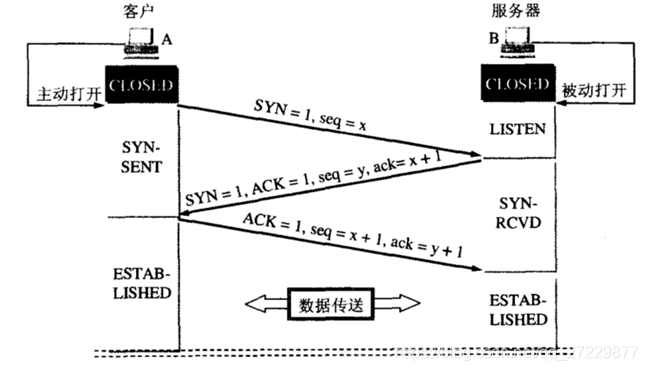
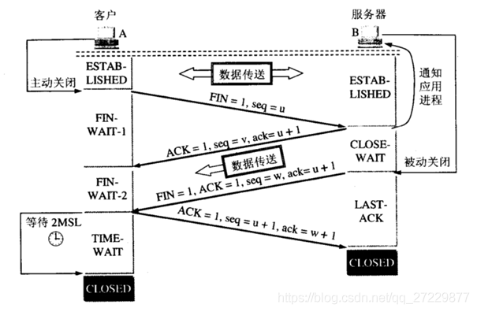

# 计算机网络


# 1. `TCP/IP`模型的各层功能

| TCP/IP参考模型 | 协议栈                                                       |
| -------------- | ------------------------------------------------------------ |
| 4. 应用层      | HTTP、Telnet、FTP、SMTP、简单网络管理协议SNMP                |
| 3. 传输层      | TCP、UDP                                                     |
| 2. 网络层      | ARP、IP、RARP、ICMP（网络控制信息协议）                      |
| 1. 网络接口层  | 高级链路控制协议(HDLC)<br />点对点协议(PPP)<br/>串行线路接口协议（SLIP），令牌环，FDDI、串行光学、ATM、虚拟IP地址 |

## 1.1 网络接口层

是`TCP/IP`模型的最底层，负责接收从网络层交来的`IP`数据报，并将数据报通过底层的物理网络发送出去。或者从底层物理网络上接收物理帧，提出`IP`数据报，交给网络层。

TCP支持的网络接口类型：标准以太网，令牌环，`FDDI`，串行光学，ATM， 点对点协议，虚拟`IP`地址

## 1.2 网络层 【`IP`数据报】

是`TCP/IP `模型的第二层，是整个`TCP/IP `协议栈的核心，网络层负责将源主机的报文分组发送到目的主机，源主机和目的主机可以在一个网络，也可以不在一个网络。

网络层的主要功能如下：

1. 处理来自传输层的分组发送请求。

   在收到分组发送请求后，将分组装入`IP`数据报，填充报头，选择发送路径，然后将数据报发送到相应的网络传输线。

2. 处理接收的数据报。

   在接收到其他主机发送的数据报之后，检查目的地址，如果目的地址为本结点的`IP`地址，就除去报文头，将数据交给传输层处理，如果不是本结点的`IP`地址，则选择转发路径，转发数据

3. 处理互联的路径，流控与拥塞问题

网络层定义了分组格式和协议，即IP协议，也称为网际协议，**为上层提供不可靠的，尽最大努力完成的，无连接的**数据报传输服务。

## 1.3 传输层

传输层的功能是在源主机与目的主机的对等实体之间建立用于会话的端-端连接。**为了保证数据传输的可靠性，传输层也提供了确认，差错控制和流量控制等机制**。

传输层从应用层接收数据，并且在必要的时候把它分成较小的单元，传递给网络层。确保到达对方的各段信息正确无误。

传输层定义了两种协议：TCP | UDP

## 1.4 应用层

应用层为用户提供网络应用，并为这些应用提供网络支撑服务，为应用程序提供网络接口。应用层要处理高层协议，数据表达和对话控制等任务。

应用层包括了所有的高层协议，面向不同的网络应用引入了不同的应用层协议，并且总是不断有新的协议加入。

---

**TCP/IP协议的工作流程如下：**

1. 在源主机上，应用层将一串应用数据流传送给传输层
2. 传输层将应用层的数据流分组，并加上TCP报文头形成TCP段，交付给网络层
3. 网络层给TCP段加上IP报文头，IP报文头包含源主机IP和目的主机IP， 形成一个IP数据包，并将数据包交付给网络接口层。
4. 网络接口层在其MAC帧的数据部分 装上IP数据包，再加上源、目的MAC地址，帧头和帧尾，然后根据其MAC地址，将MAC帧发往目的主机或者路由器。
5. 在目的主机上，网络接口层将MAC帧的帧头和帧尾去掉，将IP数据包提交给网络层。
6. 网络层检查IP报文头，如果校验不对，则丢弃该IP数据报，如果校验正确，则去掉IP报文头，将TCP数据包提交给传输层。
7. 传输层检查顺序号，判断是否是正确的TCP分组，然后检查TCP报头数据，若正确，则向源主机发送确认信息，若不正确或者丢包，则向源主机要求重发信息。
8. 传输层去掉TCP报文头，将排好顺序的分组组成数据流传送给应用层。

# 2. 各个层的详细介绍

## 2.1 网络接口层

### 2.1.1 信号和编码

### 2.1.2 数据传输

根据信息传输方向和时间关系，可以分为三种通信操作方式：单工、半双工、全双工

> <font color="#f9826c">单工</font>

在单工通信中，发送器和接收器之间只有一个传输通道，信息单方向地从发送器传到接收器。信号只能向一个方向传输，信号的发送端和接收端是固定的，无线广播和电视广播都是单工通信。

> <font color="#f9826c">半双工通信</font>

在半双工通信中，两个设备之间有两个传输通道，可以分时轮流进行双向的信号，信号可以双向传送，但是在同一时刻，信号只能向一个方向传送。

半双工通信方式一般在通信设备或传输通道的宽带不足，没办法支持全双工通信，或通信双方的通信顺序需要交替进行的场合。如无线对讲机。

> <font color="#f9826c">全双工通信</font>

在全双工通信中，两个设备之间有两个传输通道，可以同时进行双向的信息传输。电话采用的是全双工

### 2.1.3 数据交换技术

数据交换技术主要是指网络 中间结点 所提供的数据交换功能。通常，在网络系统中主要使用三种交换技术：电路交换，报文交换，和分组交换

> <font color='#0088ff'>电路交换 Circuit Switching </font>

在电路交换中，通过中间结点在两个端点之间建立一条专用的物理连接。如电话交换系统。在基于电路交换的网络系统中，两个端点之间必须建立实际的物理连接才能进行数据通信。

每一段电路都要为该连接提供一条信道。传输的数据可以是数字信号，也可以是模拟信号，这种通信通常是全双工方式，数据可以双向传输。

在电路交换的方式中，一次数据通信过程要经历三个阶段：1. 电路建立阶段；2.数据传输阶段；3. 电路拆除阶段。

电路交换的优点：

1. 传输延迟小，通路建立起来后，唯一的时延就是电信号的传输时间，传输延时是固定不变的
2. 通信线路非常稳定，不会有竞争者争用路线，非常适合语音等实时性传输业务
3. 信息编码方法，信息格式以及传输控制程序等不受限制

> <font color='#0088ff'>报文交换 Message Switching</font>

在报文交换中，通信双方不需要建立专用的信道。如果一个端点想要发送报文，则需要把目的地址添加在报文中一起发出去。<font color='green'>数据的传输单位是报文</font>。

报文从一个结点传输到另一个结点时，在每一个结点上，需要接收整个报文并暂时存储，然后经过路由选择再发送到下一个结点。因此这种方式也叫==存储转发报文方式==。

在存储转发的方式中，任何时刻报文只在一个线路上传输，每一个结点在存储转发时，都进行校验，纠错，对报文的可靠性负责。这样的优点是：

1. 在通信时无须建立一条专用的通道，任何时刻一份报文只占有一条路线，提高了通信资源的利用率。
2. 每一个结点在存储转发时，都进行校验，纠错，实现数据的可靠传输。

缺点：

1. 需要各个站点有较大的存储空间，以备存储整个报文。
2. 由于每个结点都要把报文完整的接收，存储，校验，纠错，转发，因而产生了结点时延，并且报文交换对报文的长度没有限制，长报文在传输时可能长时间占用某两个结点的链路，不利于实时交互通信

>  <font color='#0088ff'>分组交换 Packet Switching</font>

分组交换与报文交换十分相似，主要的差别是，在分组交换中，限制了传输数据单元的长度。

对于分组交换，如果报文长度超过了最大长度的限制，就必须将报文分成若干个较小的数据单元才可发送，每次只能发送一个单元。<font color='green'>分组交换的数据单元称为分组(Package)</font>, 每一个分组中都包含了数据和地址信息，传输过程与报文交换方式相似。

:arrow_forward: 由于计算机通信网络几乎全都采用存储转发方式，因此有时也把数据通信子网称为`交换网`。

在分组交换中，通常采用==数据报==和==虚拟电路==两种方式处理这些分组流。

:one: 数据报（Datagram）

数据报方式中，每个分组将独立地进行传输，由于网络的中间交换结点对每个分组可能会选择不同的路由，这些分组到达目的端点的顺序可能不同，所以目的端必须重新排序分组，组成一个完整的报文。在这种方式中，这些被独立传输的分组被称为数据报。

:two: 虚拟电路 (Virtual Circuit)

虚拟电路方式中，数据传输过程和电路交换方式类似，同样分为三个阶段：建立连接，数据传输和拆除连接。

1. 建立连接。源端在发送数据之前，首先建立一条逻辑连接，网络中间结点将根据请求在源节点和目的结点之间预先建立一条传输路径。由于该路径上的各段路线是共享的，并非独占的，因此这种连接也被称为虚拟电路
2. 数据传输。数据在这条虚拟电路上交换数据，并且每个数据分组都必须包含一个<font color='green'>虚拟电路标识符</font>，用于标识这个虚拟电路。由于虚拟电路的传输路径是预先选择好的，因此每个中间结点只要根据电路标识符就能查找到相应的路径，用来传输这些数据的分组，无需重新选择路由。
3. 拆除连接。任一个端点都可以发出拆除连接请求分组，终止这个虚拟电路。

虚拟电路是一种面向连接的数据传输方式，既不像电路交换那样需要一条专用的通道，也和数据报方式不同。虚拟电路只有在建立连接时选择一次路由，在传输过程中不需要为每个分组选择路由。

电路交换技术是一种广泛应用于网络中的交换技术，现有的公共数据交换网都采用分组交换技术，电路交换技术主要用于综合业务数字网<font face="Times New Roman">(Integrated Services Digital Network, ISDN)</font>。

# 3. 各层协议

## 3.1  网络接口层

网络接口层主要的协议有：高级数据链路控制（High Level Data Link Control, HDLC）点对点协议（PPP） 

### 3.1.1 HDLC (High Level Data Link Control, HDLC)

高级数据链路控制协议 `HDLC` 具有高效，高可靠性以及传输任意数据的特点，现在被广泛应用于广域网以及局域网中。

> 3.1.1.1 三种类型的工作站

HDLC将站点分为三种类型： 主站，次站和复合站

1. <font color='#0088ff'>主站</font>：主站对链路进行控制，在通信过程中负责对数据链路进行全面的管理，包括发起传输，组织数据流，执行链路级差错控制与恢复等。主站发出的帧叫做==命令帧==。

2. <font color='#0088ff'>从站</font>：从站在主站的控制下，只能按照主站的命令执行执行相应的操作。从站发出的帧叫做==响应帧==。主站为每一个线路维持一条逻辑链路。

3. <font color='#0088ff'>复合站</font>：复合站具有主站和从站的双重功能，既可以发送命令帧，也可以发送相应帧。两个复合站之间完全可以对等地进行通信。

复合站具有平衡链路控制的能力。

另外，HDLC定义了两种数据链路：不平衡式链路结构和平衡式链路结构。这两种链路的配置是：

1. <font color="green">不平衡式链路结构</font>：适用于点对点和多点链路，这种链路配置由一个主站和多个从站组成，支持全双工或半双工。
2. <font color="green">平衡式链路结构</font>：**仅**用于点对点链路，由多个复合站组成，支持全双工或半双工。

> 3.1.1.2 三种响应方式

HDLC 规定了三种数据传输响应方式：正常响应方式，异步平衡方式，异步响应方式

1. <font color='#0088ff'>正常响应方式 (Normal Response Mode, NRM)</font> : 适用于不平衡链路，只有主站才能启动数据传输，从站只能在收到主站的命令时才能发送数据。次站发出最后的响应帧后，将停止发送，直到再次接收到主站的命令后才能重新开始传输。NRM传输一帧或多帧数据，同时保持占线状态。
2. <font color='#0088ff'>异步平衡方式 (Asynchronous Balanced Mode, ABM)</font>： 适用于平衡式链路，任何一个复合站都可以发送数据，不需要取得其他站的指令。
3. <font color='#0088ff'>异步响应方式 (Asynchronous Response Mode, ARM)</font>:  适用于不平衡链路，从站无须取得主站的指令就可以传输数据，主站只负责管理线路。

> 3.1.1.3 传输的帧格式

在 HDLC中，传输的数据是==以帧为单位的==。HDLC的帧类型主要有三种：1. 信息帧（I 帧）2. 监控帧 (S帧) 3. 无编号帧(U帧)

1. 信息帧（I帧）：用于<font color='red'>信息的传输</font>，每个帧都有一个发送序号`N(S)`， 一个接收序号`N(R)`和一个探寻/终止位`(Polling/Final, P/F)`，发送站用`N(S)`来表示发送帧的序号，接收站用`N(R)`给出确认，表明已经正确接收`N(R)-1`个帧，下一个要接收的帧序号是`N(R)`。主站每次发送信息帧都将`P/F`位置为1，表示允许从站传输数据，直到从站发送的响应帧的`(P/F)`为1，表示传输终止，表示这一批数据传输完毕。
2. 监控帧（S帧）：用于进行<font color='red'>流量和差错控制</font>。适用于面向连接的数据传输，执行数据链路的监控功能。如，确认，要求重发和请求暂停等。S帧不含信息字段，不设置发送序号。监控帧接收站发出，有四种类型：
   1. 接收准备好(Receive Ready): **接收站**使用RR帧对接收到的`I帧`进行应答，表示已经准备好接收第`N(R)`号帧。
   2. 接收未准备好(Receive Not Ready, RNR)：接收站使用RNR帧进行应答，表示暂时不能接收第`N(R)`号帧。
   3. 请求重发（REJ）：接收站发送REJ帧，表示请求对方重发从`N(R)`号帧开始的各个信息帧。
   4. 选择请求重发（SER）：接收站发送SER帧，表示请求对方只发送第`N(R)`号帧，其他编号已经全部被正确接收。
3. 无编号帧（U帧）: 用于<font color='red'>链路控制</font>。提供无连接数据传输和链路控制功能，如设置工作方式，拆除链路等。这类帧不设置编号，也不改变信息帧流动的顺序。

## 3.1 网络层协议

网络层主要有四个协议：IP协议、ARP协议、RARP协议、ICMP协议

### 3.1.1 IP (Internet Protocol)

它的主要功能是实现无连接的数据报传输服务和数据报路由选择。IP将数据报传送到目的地址后，不管传送正确与否都不进行检查，不回送确认，不保证分组的正确进行，没有流量控制和差错控制功能。这些功能留给上层协议TCP完成。

### 3.1.2 ICMP （Internet Control Message Protocol）

是为了IP协议的路由选择功能而定的协议。在路由选择过程中，可能出现种种差错和故障，如线路故障，主机断链，超过生存时间，主机或路由发送拥塞。ICMP专门用来处理差错报告和控制。由出错设备向源设备发送出错报文或控制报文，源设备接收到该报文后，由ICMP确定错误类型或重发数据报的策略。

ICMP报文不是一个独立的报文，而是封装在IP数据报中。

ICMP提供的服务有测试目的地的可达性和状态，报文不可达的目的地，数据报的流量控制和路由改变请求。

### 3.1.3 ARP (Address Resolution Protocol)

ARP协议是将`IP`地址与物理地址`MAC`进行转换。ARP协议采用广播消息的方法，来获取网上IP地址对应的MAC地址。

### 3.1.4 RARP (Reverse Address Resolution Protocol)

反向ARP协议是将`MAC`地址转换为`IP`地址。同样采用广播消息的方法，来获取特定硬件MAC地址对应的IP地址

## 3.2 传输层协议

传输层协议主要有`TCP` 和`UDP`

### 3.2.1 TCP (Transport Control Protocol)

面向连接的协议，为网络提供有序可靠传输能力的全双工虚电路服务。TCP允许从一台主机发出的字节流毫无差错地发送到其他主机上。

在接收端，TCP把收到的报文组装成输出流。其功能包括，分组丢失检测，对收不到确认的信息自动重传，以及处理延迟的重复数据报。TCP能进行流量控制和差错控制

TCP进行报文交换的过程：建立连接，发送数据，发送确认，通知窗口大小，在数据发送完毕后关闭连接。由于TCP在发送数据时，报文头包含控制信息，所以发送下一帧数据时，可以同时包含上一帧数据的控制、确认等信令。


> <font color='#007acc'>TCP三次握手过程</font>

三次握手的过程：

三次握手
> <font color='#007acc'>为什么要三次握手？</font>

1. **防止重复连接**。 
三次握手的主要是为了防止旧的重复连接引起连接混乱的问题。比如说在网络比较差的情况下，客户端可能会连续多次发送连接的请求。<font color='#f44736'>如果TCP是两次握手，那么服务端只能选择接受请求或者拒绝请求，但是服务端不清楚这次的请求是正常的请求，还是由于网络环境问题而导致的过期请求。如果是过期请求，就会造成错误的重复连接。</font>
<font color='#487e02'>如果TCP是三次握手，那么客户端在收到服务器的消息后，就可以判断当前的连接是否为历史连接。如果是历史连接的话就会发送终止报文(RST)给服务器终止连接；如果判断当前连接不是历史连接的，就会发送指令给服务器端来确认建立连接。</font>

2. **同步初始化序列号**。 
TCP为了保证在网络不稳定的情况下建立一个稳定的连接，就需要一个"序列号"字段来保证连接的稳定型。这个序列号的作用就是防止数据包重复发送，解决数据包接收时顺序颠倒的问题。所以，TCP建立连接的时候<font color='#487e02'>需要同步一个序列号</font>来保证TCP的稳定性。
   1. 第一次握手：客户端发送一个携带初始序列号的SYN报文给服务器端。
   2. 服务端接收到消息之后会回复一个ACK确认报文，表示客户端的SYN报文已经被服务器端成功接收。
   3. 客户端接收到消息后，会发送一个ACK报文给服务端，服务器接收到这个消息后，就可以得到一个可靠的初始化序列号了。

   <font color='#f44747'>如果是两次握手的话，就无法进行序列号的确认工作，因此无法得到一个可靠的序列号</font>，所以TCP连接至少需要三次握手。

> <font color='#007acc'>TCP 四次挥手过程</font>




1. 客户端发送FIN = 1 断开连接的报文，携带随机生成的seq=u,发送给客户端。客户端处理FIN-WAIT状态。
2. 服务段收到FIN报文后，回复一个确认报文(ACK=1)，随机生成一个seq=v, 设置ack=u+1。此时， 服务端收到关闭请求的时候可能这个时候数据还没发送完，所以服务端会先回复一个确认报文，表示自己知道客户端想要关闭连接了，但需要等待数据传输完；
3. 当服务端发送完数据后， 再发送一个FIN=1报文给客户端，通知客户端，服务端准备关闭连接了，此报文设置ACK=1，FIN = 1, ack=u+1(u为客户按发送报文的序列号),seq=w。 第三次挥手，当数据传输完，服务端会主动发送FIN报文，告知客户端，表示数据已经发送完毕，服务端准备关闭连接了。

4. 当客户端收到FIN=1的报文时，再发送一个FIN的确认报文，其中ACK=1， ack=w+1, seq=w+1(w为服务端发送报文的序列号)。

   1. 客户端进入TIME-WAIT状态，等待2*MSL后关闭连接。

   2. MSL为：(Maxinum Segment Life time,最大报文生存时间，一般为30秒)

> <font color='#007acc'>为什么要四次挥手</font>

四次握手是为了保证数据传输完毕后再关闭连接，保证双方都达到关闭的条件才能断开。

> <font color='#007acc'>为什么客户端在第四次挥手后还会等待2MSL</font>

1. **为了保证服务端能正确收到了来自客户端的ACK报文。**
当网络出现延迟的时候，<font color='#dd001b'>最后一次挥手的ACK报文可能会丢失，如果服务端没有收到ACK报文的，会重新发送FIN报文，只有客户端等待了2MSL都没有收到重复的FIN报文时，才表示服务端是正常接受了ACK报文，此时客户端就能正常关闭了</font>

2. **处理延迟到达的报文段**。
由于路由器可能抖动，TCP报文会延迟到达，为了避免【延迟到达的TCP报文】被误认为是【新的TCP连接】的数据，则需要在允许新创建TCP连接之前，保持一个不可用状态，等待所有延迟报文的消失。一般设置为2倍的MSL，解决【延迟到达的TCP报文】问题。


> 大量的 TIME WAIT 状态带来的影响

在高并发场景下，TIME-WAIT连接存在属于正常现象。

Nginx 作为反向代理，大量的短连接，可能导致Nginx上的TCP连接处理time wait状态：
1. 每一time_wait 状态， 都会占用一个本地端口，上限为65535， $2^{16}$。
2. 当大量的连接处于 time wait 状态时，新建立的TCP连接会出错。会报错, address already in use: connect 异常。

**统计TCP连接的状态**
```shell
$ netstat -n | awk '/^tcp/ {++S[$NF]} END {for (a in S) print a, S[a]}'

ESTABLISHED 1154
TIME_WAIT 1645
```

> 大量的TIME_WAIT状态TCP连接存在，其本质原因是什么?

1. 大量的短连接存在。
2. 特别是HTTP请求中，HTTP默认的Connection值为close, 意味着请求关闭的基本都由服务端发起主动关闭连接。
3. TCP四次挥手关闭连接机制中，为了保证ACK重发和丢弃延迟数据，设置time_waitz为2MSL。

**解决办法**
1. 【客户端】：HTTP请求的头部，connection设置为keep-alive，请求服务器将链接保持存活。

   1. 在HTTP 1.0协议中，有Connection头，Connection有两个值，close 和 keep-alive, 这个头就相当于客户端告诉服务器，该执行完成请求后，是关闭连接(close)还是保持连接(keep-alive)，保持连接就意味着在保持连接期间，只能由客户端主动断开连接。
   2. keep-alive的值代表服务端保持多长时间的连接。
2. 【服务端】
   1. 允许time_wait状态的socket被重用。
   2. 缩减 time_wait 时间，设置为 1 MSL (即：2mins)
   
   服务器端一般设置不允许主动关闭连接。但是在HTTP请求中，http头部connection参数可能设置为close, 则服务器处理完请求会主动关闭TCP连接。


---
### 3.2.2 UDP（User Datagram Protocol）

UDP是对IP协议的扩充，使发送方可以区分其他计算机上的多个接收者，它采用无连接的方式进行传输，不建立端到端的连接，而是将数据报送入网络或者从网络上接收数据。

它不保证数据的可靠传输，用于不需要TCP排序和流量控制而是自己完成这些功能的应用程序。

UDP可以根据端口号对许多应用程序进行**多路复用**， 并能利用【**校验和**】检查数据的完整性。它被广泛应用于一次性的Client/Service 模式查询，以及快速递交比准确递交更重要的应用程序，如传输语音或影像。

## 3.3 应用层协议

应用层协议主要有：HTTP、FTP、SMTP、Telnet；

常见的应用支撑协议：DNS域名服务、简单的网络管理协议SNMP

### 3.3.1 Telnet 网络终端协议

网络终端协议是Internet 远程登陆服务的标准协议和主要方式，通过TCP建立服务器和客户机之间的连接，为用户提供了在本地计算机上完成远程主机工作的能力。

### 3.3.2 FTP (File Transfer Protocol)

文件传输协议用于实现互联网中交互式文件传输功能，使得主机之间可以共享文件，FTP使用TCP生成一个虚拟连接用于控制信息，然后再生成一个单独的TCP连接用于数据传输。

### 3.3.3 SMTP (Simple Mail Transfer Protocol)

简单邮件传输协议是一种提供可靠且有效电子邮件传输协议，主要用于传输系统之间的邮件信息并提供来信有关的通知。`SMTP`是建立在`FTP`上的一种邮件服务。

### 3.3.4 DNS (Domain Name System)

域名系统协议是一种分布式网络目录服务，主要用于实现互联网域名到IP地址映射的网络服务，大多数Internet服务都依赖于DNS，一旦DNS出错，就无法连接到Web站点。

### 3.3.5 HTTP
> Http和Https的区别

1. http是超文本传输协议，信息是明文传输。https则是具有安全性的ssl加密传输协议。
2. http和https使用的是完全不同的连接方式，用的端口也不一样。
3. http的连接很简单，是无状态的。HTTPS协议是由SSL+HTTP协议构建的可进行加密传输、身份认证的网络协议，比http协议安全。
4. http默认使用80端口，https默认使用443端口。

> HTTP的工作原理

一次HTTP操作称为一个事物，其工作过程可分为四步

1. Client与Server建立连接，单击某个超链接，HTTP的工作开始。

2. 连接建立后，Client发送一个请求给Server，请求方式的格式为：统一资源标识符（URL）、协议版本号，后边是MIME信息包括请求修饰符，Client信息和可能的内容。

3. Server接到请求后，给予相应的响应信息，其格式为一个状态行，包括信息的协议版本号、一个成功或错误的代码，后边是MIME信息包括Server信息、实体信息和可能的内容。

4. Client接收Server返回的信息通过浏览器显示在用户的显示屏上，然后Client和Server断开连接。

> HTTPS的工作原理

1. Client使用HTTPS的URL访问Web服务器，要求与Web服务器建立SSL连接。

2. Web服务器收到客户端请求后，会将网站的证书信息（证书中包含公钥）传送一份给客户端。

3. 客户端的浏览器与Web服务器开始协商SSL连接的安全等级，也就是信息加密的等级。

4. 客户端的浏览器根据双方同意的安全等级，建立会话密钥，然后利用网站的公钥将会话密钥加密，并传送给网站。

5. Web服务器利用自己的私钥解密出会话密钥。

6. Web服务器利用会话密钥加密与客户端之间的通信。

> Http重定向

1. forward: 转发。执行forward时，浏览器不知道服务器发送的内容是从何处来，浏览器地址栏中还是原来的地址
2. redirect: 重定向。执行redirect时，服务器端告诉浏览器重新去请求地址
   1. 302代表暂时性转移
   2. 301代表永久性转移
   3. 默认的是302代码

### 3.3.6 RIP (Routing Information Protocol)

路由信息协议是路由器用来在网络上交换路由信息的协议。路由器之间不断的交换信息，使得路由器动态地适应网络连接的变化，这些信息包括路由器可以到达那些网络，这些网络有多远。

### 3.3.7 SNMP (Simple Network Management Protocol)

简单网络管理协议用于收集网络管理信息并在网络管理控制台和网络设备（网桥或服务器）之间交换网络管理信息。

# 4. 介质访问控制技术与局域网

传统局域网一般都属于信道共享连接的问题，局域网采用集线器进行网络连接。信道共享连接的网络大多是广播网，在这种网络中，基本不存在路由选择的问题，需要解决信道共享产生的竞争问题，因此对于信道共享连接的广播网络，不设置网络层，而是==将数据链路成分为两个子层==：逻辑链路控制层LLC，介质访问控制层MAC。MAC主要功能是负责与物理层相关的所有问题，介质访问控制技术是该子层的主要功能。

## 4.1 CSDM/CD

对于信道共享连接的网络，大多采用随机访问技术，即所有用户都可以随机地发送信息。但是当两个或多个用户同时发送消息时，就产生了冲突，导致用户的发送失败。

> CSMA

载波监听多路访问（Carrier Sense Multiple Access, CSMA）每个站点在发送数据前都要监听信道，如果信道空闲，则发送数据，如果信道忙，不暂时发送数据，等待一段时间后再监听。根据监听的方式，可以将CSMA分为三类：

1. 坚持CSMA：它的监听方式是，当监听到信道忙时，一直监听，直到信道空闲，就立即将数据帧发送出去。若有两个或更多的站点在监听信道，一旦信道空闲就会同时都发送数据，反而引起冲突，不利于吞吐量的提高。
2. 不坚持CSMA：当监听到信道忙时，就不再继续监听，而是根据协议的算法延迟一个随机的时间后再重新监听。
3. P坚持CSMA：当监听到信道忙空闲时，就以`P`概率发送数据，以`(1-P)`延迟一段时间，重新监听信道，`P`坚持CSMA协议可以根据信道上通信量的多少设定不同的`P`值。

> CSMA/CD 

载波监听多路访问/冲突检测 （Carrier Sense Multiple Access / Collision Detection, CSMA/CD）。由于信号的传输会传播延时，采用CSMA协议并不能完全消除冲突。为了能及时发现冲突，发送数据帧的站点边发送数据边监听信道，只要监听到发生冲突，就立即停止发送。

在实际网络中，为了每个站点都能及早发现冲突，采取一种强化冲突的措施，当发送站一旦检测冲突，立刻停止发送数据并发送若干比特的干扰信号，以便让所有站点都知道发生了冲突。

<font color='yellow'>二进制指数退避算法</font> ，在CSDM/CD协议中，当检测到冲突后，要等待随机的时间再监听。等待的随机时间采用二进制指数退避算法。即：

1. 当站点发生第1次冲突，等待$[0,2^1-1]$个时间片。
2. 当站点发生第2次冲突，等待$[0,2^2-1]$个时间片。依次类推，当站点发送第n次冲突，在$n <= 10$时，等待$[0, 2^n-1]$个时间片；在$n>10$时，等待$[0, 2^10-1]$个时间片；

当站点发生冲突达到16次时，放弃该数据帧的发送。

## 4.2 令牌环 Token Ring

令牌环介质访问控制多用于环状拓扑结构的网络。令牌环集线器拥有4， 8， 12， 16端口类型，每个集线器有一个入环端口`Ring-In`以及一个出环端口`Ring-Out`。

>  令牌环介质访问控制的操作过程

1. 令牌环网中使用一个特殊的令牌帧，当某个站点有数据要发送时，必须等待标记为空的令牌帧到来，然后将标记改为忙，然后将数据帧发送到环上。
2. 发送的数据帧在环上循环过程中，所经过的各个站点都将数据帧上的目的地址与本站点地址进行比较，若不等，则转发。若相等，则将帧复制接收，然后继续传给后面的站点。
3. 发送的数据帧在换上循环一周后再回到发送站，发送站将数据帧从环生移去，同时将令牌帧的忙标记改为空标记，传给后面的站点。
4. 空令牌帧在环上循环，经过某站点时，若该站点需要发送 数据，则重复上述过程。

只有拿到令牌的站点才可以发送帧，其他站点只能接收不能发送。  

## 4.3 局域网的设备

### 4.3.1 网卡

在发送方，网卡将内存中的数据转换为相应信号发送到传输介质上；在接收方，目的设备的网卡将接收到信号转换为计算机能够处理的数据。

数据的封装与解封：将LLC子层交接下来的LLC帧加上MAC子层的首部和尾部，转换为MAC帧发送到传输介质上；接收时MAC层剥去首部和尾部，形成LLC帧，提交给LLC子层。

### 4.3.2 中继器 Repeater

中继器是应用于物理层的连接，它的作用是对网络电缆上的数据进行放大，整形，然后再传输给电缆上的其他网段。因此，中继器能够起到延长网络距离的作用。用中继器连接起来的站点，逻辑上是同一个网络，也就表示，中继器不能提供网段隔离功能。

中继器按照连接的介质可以分为，==电缆中继器==：用于双绞线和同轴电缆，==光缆中继器==：用于光纤。

中继器的<font color='#f9826c'>优点</font>：可以扩展网络长度，可以连接两个协议相同但是传输介质不同的网络。

中继器的<font color='#f9826c'>缺点</font>：中继器只能用于同构网之间的互联；使用中继器连接的网络，不能进行通信分段，连接后增加了网络的负荷，容易发生阻塞。

### 4.3.3 集线器 Hub


【参考链接】
1. https://zhuanlan.zhihu.com/p/415762394
