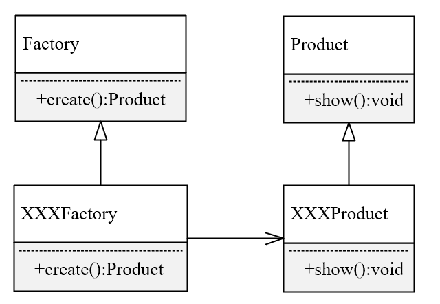

<h1><center>设计模式</center></h1>

# 1.设计模式的六大原则

1. 开闭原则： 通过**扩展**来解决需求变化，而不是通过**修改**已有的代码来完成变化

2. 里氏替换原则： 子类可以扩展父类的功能，但不能改变父类原有的功能 
3. 依赖倒转原则： 在传递参数时，尽量引用层次高的抽象层类，核心思想是面向接口编程
4. 接口隔离原则： 使用多个隔离的接口，比使用单个接口要好，降低类之间的耦合度 
5. 迪米特原则： 一个类尽量减少自己对其他对象的依赖，降低耦合，高内聚 
6. 单一职责原则： 一个方法只负责一件事情

# 2. 单例模式 Singleton

## 2.1 概念

保证在整个程序运行时，单列类只允许有一个实例，并且提供一个全局访问点。（可以理解，世界只有一个地球，一个月球，大家都能看到，这里的地球和月球就是单例对象）

- 优点：可以节约系统资源，不需要频繁创建和销毁一个对象
- 缺点：
  - 不适用于变化的对象，如果同一类型的对象总是要在不同的用例场景发生变化，单例就会引起数据的错误，不能保存彼此的状态。
  - 由于单利模式中没有抽象层，因此**单例类的扩展有很大的困难**。

## 2.2 实现方式

> 懒汉式

类初始化时，不会初始化该对象，真正需要使用的时候才会创建该对象。

```java
public class Singleton {
    private static Singleton singleton;
    public synchronized static Singleton getInstance() {
        if (singleton == null) {
            singleton = new Singleton();
        }
        return singleton;
    }
}
```

> 饿汉式

类初始化时,会立即加载该对象，线程安全,调用效率高

```java
public class Singleton {
    private static Singleton singleton = new Singleton();
    public static Singleton getInstance() {
        return singleton;
    }
}
```

> **双重校验锁**

```java
public class Singleton {
    private volatile static Singleton unique;
    private  Singleton(){ }
    public static Singleton getUnique(){
        if(unique==null){
            synchronized (Singleton.class){
             if(unique==null){
                 unique=new Singleton(); 
             }
            }
        }
        return unique;
    }
}
```

# 3. 工厂模式 Factory

## 3.1 概念 

> 类图 



在工厂方法模式中，核心的工厂类不负责对象的创建，而是将具体创建的工作交给子类去做。该核心类成为一个抽象工厂角色，仅负责给出具体工厂子类必须实现的接口，而不实现实例化细节。由具体工厂来创建对象。 

> 优点

创建对象时不会对外暴露创建逻辑，并且是通过使用一个共同的接口来指向新创建的对象 。可以解耦合

> 缺点

当类型过多时不利于系统的扩展维护。

## 3.2 实现方式

```java
//抽象工厂
abstract class Factory{
    abstract Product create();
}
//抽象产品
abstract class Product{
    abstract void show();
}

class PenProduct extends Product{
    @Override
    public void show() {
        System.out.println("This is pen product");
    }
}
class EasterProduct extends Product{
    @Override
    void show() {
        System.out.println("This is easter product");
    }
}
// 具体工厂生产笔
class PenFactory extends Factory{
    @Override
    public Product create() {
        return new PenProduct();
    }
}
// 具体工厂生产橡皮
class EasterFactory extends Factory{
    @Override
    Product create() {
        return new EasterProduct();
    }
}

//测试
public class Solution {
    public static void main(String[] args) {
        //生产笔的厂家
        Factory penFactory = new PenFactory();
        Product pen = penFactory.create();
        pen.show();
        //生产橡皮的厂家
        Factory easterFactory = new EasterFactory();
        Product easter = easterFactory.create();
        easter.show();
    }
}
```

# 4. 代理模式Proxy

## 4.1 概念

>  UML类图


通过代理控制对象的访问，可以在这个对象调用方法之前、调用方法之后去添加新的功能。 （中间商）

> 应用场景

Spring AOP，日志打印，异常处理，事务控制，权限控制

> 静态代理

自行代理类，再编译代理类。就是在程序运行前就已经存在代理类的字节码文件

- 缺点：因为代理对象`Proxy`需要与目标对象`RealSubject`实现同一个接口。当有很多代理类时，接口增加方法,时，目标对象`Proxy`与代理对象`RealSubject`都要维护
- 优点：可以做到在不修改目标对象的功能前提下,对目标功能扩展.以Spring容器为例在程序运行时候我们可以实现一个扩展对象,直接替换容器里原来的对象只要他们是同一个接口就行,这样就实现了运行期间动态扩展了,不会影响程序的运行

> 动态代理

**JDK动态代理的特点：**

1. 代理对象，不需要实现被代理类的接口
2. 代理对象的生成，是利用JDK的API，动态的在内存中构建代理对象（需要指定动态代理对象的类型）

JDK的动态代理有一个限制,就是使用动态代理的对象必须实现一个或多个接口,如果想代理没有实现接口的类,就可以使用Cglib实现.

**Cglib动态代理的特点：**

静态代理和动态代理模式都是要求目标对象实现一个接口,但是有时候目标对象是一个单独的对象(比如Controller层),并没有实现任何的接口,这个时候就可以使用, 以目标对象子类的方式类实现代理,这种方法就叫做:Cglib代理

Cglib代理,也叫作子类代理,它是在内存中构建一个子类对象从而实现对目标对象功能的扩展

Cglib是一个强大的高性能的代码生成包,它可以在运行期扩展java类与实现java接口.它广泛的被许多AOP的框架使用,例如Spring AOP和synaop,为他们提供方法的interception(拦截)

Cglib包的底层是通过使用一个小而快的字节码处理框架`ASM`来转换字节码并生成新的类.不鼓励直接使用ASM,因为它要求你必须对JVM内部结构包括class文件的格式和指令集都很熟悉

> 关于AOP面向切面编程的几个名词术语解释

- 


## 4.2 实现方式

	> 静态代理

```java
interface Subject{
    void doSomething();
}

class SubjectImpl implements Subject{
    @Override
    public void doSomething() {
        //需要代理的方法
        System.out.println("this is subject method");
    }
}
//代理类
class Proxy implements Subject{
    //代理对象
    Subject subject = new SubjectImpl();
    @Override
    public void doSomething() {
        System.out.println("before method");
        subject.doSomething();
        System.out.println("after method");
    }
}
//测试
public class Solution {
    public static void main(String[] args) {
       Subject subject = new Proxy();
       subject.doSomething();
    }
}
```

> JDK代理类的实现

JDK实现代理核心只需要使用`Proxy.newProxyInstance`方法。`newProxyInstance(ClassLoader loader, Class<?>[] interfaces,InvocationHandler h )`

1. loader:  一个`ClassLoader`对象，定义了由哪个ClassLoader对象来对生成的代理对象进行加载，获取被代理对象的ClassLoader即可（使用class类下的`getClassLoader`方法）。
2. interfaces:  一个Interface对象的数组，被代理对象所实现的所有接口。
3. h:  一个InvocationHandler对象，就是实现InvocationHandler接口的类，表示的是当动态代理对象在调用方法的时候，会关联到哪一个InvocationHandler对象上。

```java
import java.lang.reflect.InvocationHandler;
import java.lang.reflect.Method;
import java.lang.reflect.Proxy;

//代理类
class MyProxy<T> implements InvocationHandler{

    //被代理对象，不知道会代理什么，只能用Object代替
    private T target;

    /**
     * 创建代理对象
     * @param target 被代理对象
     * @return 创建的代理对象
     */
    @SuppressWarnings("unchecked")
    public T getProxy(T target){
        this.target = target;
        // target.getClass().getClassLoader() 获取被代理对象（target）的类加载器
        // target.getClass().getInterfaces()  获取被代理对象（target）实现的所有接口
        return (T)Proxy.newProxyInstance(target.getClass().getClassLoader(), target.getClass().getInterfaces(), this);
    }

    /**
     * 执行代理方法
     * @param proxy 代理对象，就是上面的getObject返回的对象
     * @param method 被代理方法
     * @param args 被代理方法传入的参数
     * @return 被代理方法执行后的返回值
     * @throws Throwable 执行异常
     */
    @Override
    public Object invoke(Object proxy, Method method, Object[] args) throws Throwable {
        System.out.println("before called");
        Object res = method.invoke(target, args);
        System.out.println("after called");
        return res;
    }
}
//测试
//被代理类
interface Subject{
    void doSomething();
}
//被代理类的实现
class RealSubject implements Subject{
    @Override
    public void doSomething() {
        System.out.println("do something");
    }
}

class Test{
    public static void main(String[] args) {
        Subject subject = new RealSubject();
        //创建代理
        MyProxy<Subject> myProxy = new MyProxy<>();
        Subject proxy = myProxy.getProxy(subject);
        proxy.doSomething();
    }
}
```

使用动态代理必须有接口,他是通过接口来找到继承该接口实现类方法进行代理的

**总结**：

1. Proxy类的代码量被固定下来，不会因为业务的逐渐庞大而庞大；
2. 可以实现AOP编程，实际上静态代理也可以实现，总的来说，AOP可以算作是代理模式的一个典型应用；
3. 解耦，不同实现类相同接口,实例对象可以动态相互切换

> Cglib 代理 | 子类代理

**Cglib子类代理实现方法:**

1. 需要引入cglib的jar文件,但是Spring的核心包中已经包括了Cglib功能
2. 引入功能包后,就可以在内存中动态构建子类
3. 代理的类不能为final,否则报错
4. 目标对象的方法如果为final/static,那么就不会被代理

# 5. 建造者模式 Builder Pattern

建造者模式（Builder Pattern）使用多个简单的对象一步一步构建成一个复杂的对象。这种类型的设计模式属于创建型模式，它提供了一种**创建对象的最佳方式**。

一个 Builder 类会一步一步构造最终的对象。该 Builder 类是独立于其他对象的。

## 5.1 概念

**意图**：将一个复杂的构建与其表示相分离，使得同样的构建过程可以创建不同的表示。

**主要解决**：主要解决在软件系统中，有时候面临着"一个复杂对象"的创建工作，其通常由各个部分的子对象用一定的算法构成；由于需求的变化，这个复杂对象的各个部分经常面临着剧烈的变化，但是将它们组合在一起的算法却相对稳定。

**何时使用**：一些基本部件不会变，而其组合经常变化的时候。

**注意事项：**与工厂模式的区别是：建造者模式更加关注与零件装配的顺序。

**应用实例：** 1、去肯德基，汉堡、可乐、薯条、炸鸡翅等是不变的，而其组合是经常变化的，生成出所谓的"套餐"。 2、JAVA 中的 StringBuilder。

## 5.2 实现方式

我们假设一个快餐店的商业案例，其中，一个典型的套餐可以是一个汉堡（Burger）和一杯冷饮（Cold drink）。汉堡（Burger）可以是素食汉堡（Veg Burger）或鸡肉汉堡（Chicken Burger），它们是包在纸盒中。冷饮（Cold drink）可以是可口可乐（coke）或百事可乐（pepsi），它们是装在瓶子中。

```java
import java.util.ArrayList;
import java.util.List;

interface Packing{
    String pack();
}

class Wrapper implements Packing{
    @Override
    public String pack() {
        return "Wrapper";
    }
}
class Bottle implements Packing{
    @Override
    public String pack() {
        return "Bottle";
    }
}

interface Item{
    String name();
    Packing packing();
    float pricing();
}

abstract class Burger implements Item{
    @Override
    public Packing packing() {
        return new Wrapper();
    }
}
abstract class ColdDrink implements Item{
    @Override
    public Packing packing() {
        return new Bottle();
    }
}
class VegBurger extends Burger{
    @Override
    public String name() {
        return "VegBurger";
    }

    @Override
    public float pricing() {
        return 40.0f;
    }
}
class ChickenBurger extends Burger{
    @Override
    public String name() {
        return "Chicken Burger";
    }
    @Override
    public float pricing() {
        return 30.0f;
    }
}

class Coke extends ColdDrink{
    @Override
    public float pricing() {
        return 10.0f;
    }

    @Override
    public String name() {
        return "Cold Drink";
    }
}

class Pepsi extends ColdDrink{
    @Override
    public String name() {
        return "Pepsi";
    }

    @Override
    public float pricing() {
        return 15.0f;
    }
}
class Meal{
    private List<Item> items = new ArrayList<>();
    public void addItem(Item item){
        items.add(item);
    }
    public float getCost(){
        float total = 0.0f;
        for(Item item: items){
            total += item.pricing();
        }
        return total;
    }
    public void showItems(){
        for(Item item: items){
            System.out.print(item.name() + ",");
        }
        System.out.println();
    }
}
class MealBuilder{
    public Meal prepareVegMeal(){
        Meal meal = new Meal();
        meal.addItem(new ChickenBurger());
        meal.addItem(new Coke());
        return meal;
    }
    public Meal prepareNonVegMeal(){
        Meal meal = new Meal();
        meal.addItem(new VegBurger());
        meal.addItem(new Pepsi());
        return meal;
    }

}
//Test
class Test{
    public static void main(String[] args) {
        MealBuilder builder = new MealBuilder();
        Meal vegMeal = builder.prepareVegMeal();
        Meal chickenMeal = builder.prepareNonVegMeal();
        vegMeal.showItems();
        System.out.println(vegMeal.getCost());

        chickenMeal.showItems();
        System.out.println(chickenMeal.getCost());
    }
}
```

# 6. 适配器模式 Adapter

适配器模式（Adapter Pattern）是作为两个不兼容的接口之间的桥梁。这种类型的设计模式属于结构型模式，它结合了两个独立接口的功能。这种模式涉及到一个单一的类，该类负责加入**独立的或不兼容的接口**功能。

举个真实的例子，读卡器是作为内存卡和笔记本之间的适配器。您将内存卡插入读卡器，再将读卡器插入笔记本，这样就可以通过笔记本来读取内存卡。

## 6.1 概念

**意图：**将一个类的接口转换成客户希望的另外一个接口。适配器模式使得原本由于接口不兼容而不能一起工作的那些类可以一起工作。

**主要解决：**主要解决在软件系统升级中，常常需要将一些"现存的对象"放到新的环境中，而新环境要求的接口是现对象不能满足的。

**何时使用：**

1. 系统需要使用现有的类，而此类的接口不符合系统的需要
2. 想要建立一个可以重复使用的类，用于与一些彼此之间没有太大关联的一些类，包括一些可能在将来引进的类一起工作，这些源类不一定有一致的接口
3. 通过接口转换，将一个类插入另一个类系中

**如何解决：**继承或**依赖（推荐）**

**关键代码：**适配器继承或依赖已有的对象，实现想要的目标接口。

**优点：** 1、可以让任何两个没有关联的类一起运行。 2、提高了类的复用。 3、增加了类的透明度。 4、灵活性好。

**缺点：**

1. 过多地使用适配器，会让系统非常零乱，不易整体进行把握。比如，明明看到调用的是 A 接口，其实内部被适配成了 B 接口的实现，一个系统如果太多出现这种情况，无异于一场灾难。因此如果不是很有必要，可以不使用适配器，而是直接对系统进行重构。
2. 由于 JAVA 至多继承一个类，所以至多只能适配一个适配者类，而且目标类必须是抽象类。

**注意事项：**适配器不是在详细设计时添加的，而是解决正在服役的项目的问题。

> 类图


## 6.2 实现方式

```java
interface AdvanceMediaPlayer{
    void advancePlay();
}

class VideoPlayer implements AdvanceMediaPlayer{
    @Override
    public void advancePlay() {
        System.out.println("Advanced video playing");
    }
}
class MP4Player implements AdvanceMediaPlayer{
    @Override
    public void advancePlay() {
        System.out.println("Advanced mp4 playing");
    }
}

interface MediaPlayer{
    void play();
}


//适配器
class PlayerAdapter implements MediaPlayer{
    private AdvanceMediaPlayer mp4Player = new MP4Player();
    private AdvanceMediaPlayer videoPlayer = new VideoPlayer();
    @Override
    public void play() {
        //调用高级的play;
        mp4Player.advancePlay();
        videoPlayer.advancePlay();
    }
}

// 升级原始的Audio
class BasicPlayer implements MediaPlayer{
    private PlayerAdapter adapter = new PlayerAdapter();
    @Override
    public void play() {
        //调用高级的play()方法
        adapter.play();
    }
}

//测试类
class Test{
    public static void main(String[] args) {
        BasicPlayer player = new BasicPlayer();
        //在基础类中调用高级方法
        player.play();
    }
}
```

# 7. 桥接模式 Bridge

桥接（Bridge）是用于把抽象化与实现化解耦，使得二者可以独立变化。这种类型的设计模式属于结构型模式，它通过提供抽象化和实现化之间的桥接结构，来实现二者的解耦。

## 7.1 概念

**意图：**将抽象部分与实现部分分离，使它们都可以独立的变化。

**主要解决：**在有多种可能会变化的情况下，用继承会造成类爆炸问题，扩展起来不灵活。

**何时使用：**实现系统可能有多个角度分类，每一种角度都可能变化。

**如何解决：**把这种多角度分类分离出来，让它们独立变化，减少它们之间耦合。

**关键代码：**抽象类依赖实现类。

**应用实例：** 墙上的开关，可以看到的开关是抽象的，不用管里面具体怎么实现的。

**优点：** 1、抽象和实现的分离。 2、优秀的扩展能力。 3、实现细节对客户透明。

**缺点：**桥接模式的引入会增加系统的理解与设计难度，由于聚合关联关系建立在抽象层，要求开发者针对抽象进行设计与编程。

**使用场景：** 1、如果一个系统需要在构件的抽象化角色和具体化角色之间增加更多的灵活性，避免在两个层次之间建立静态的继承联系，通过桥接模式可以使它们在抽象层建立一个关联关系。 2、对于那些不希望使用继承或因为多层次继承导致系统类的个数急剧增加的系统，桥接模式尤为适用。 3、一个类存在两个独立变化的维度，且这两个维度都需要进行扩展。

**注意事项：**对于两个独立变化的维度，使用桥接模式再适合不过了。

> 类图


## 7.2 实现方式

```java
interface DrawAPI{
    void drawCircle();
}
class RedCircle implements DrawAPI{
    @Override
    public void drawCircle() {
        System.out.println("red circle");
    }
}

class GreenCircle implements DrawAPI{
    @Override
    public void drawCircle() {
        System.out.println("green circle");
    }
}

abstract class Shape{
    DrawAPI drawAPI;
    protected Shape(DrawAPI drawAPI){
        this.drawAPI = drawAPI;
    }
    abstract void draw();
}

class Circle extends Shape{
    public Circle(DrawAPI drawAPI){
        super(drawAPI);
    }
    @Override
    void draw() {
        super.drawAPI.drawCircle();
    }
}

class Solution{
    public static void main(String[] args) {
        Circle circle = new Circle(new GreenCircle());
        circle.draw();
        Circle circle1 = new Circle(new RedCircle());
        circle1.draw();
    }
}
```

# 8.  装饰器模式Decorator 

装饰器模式（Decorator Pattern）允许向一个现有的对象添加新的功能，同时又不改变其结构。这种类型的设计模式属于结构型模式，它是作为现有的类的一个包装。

这种模式创建了一个装饰类，用来包装原有的类，并在保持类方法签名完整性的前提下，提供了额外的功能。

通过下面的实例来演示装饰器模式的用法。其中，我们将把一个形状装饰上不同的颜色，同时又不改变形状类。

## 8.1 概念

**意图：**动态地给一个对象添加一些额外的职责。就增加功能来说，装饰器模式相比生成子类更为灵活。

**主要解决：**一般的，我们为了扩展一个类经常使用继承方式实现，由于继承为类引入静态特征，并且随着扩展功能的增多，子类会很膨胀。

**何时使用：**在不想增加很多子类的情况下扩展类。

**如何解决：**将具体功能职责划分，同时继承装饰者模式。

**关键代码：** 1、Component 类充当抽象角色，不应该具体实现。 2、修饰类引用和继承 Component 类，具体扩展类重写父类方法。

**优点：**装饰类和被装饰类可以独立发展，不会相互耦合，装饰模式是继承的一个替代模式，装饰模式可以动态扩展一个实现类的功能。

**缺点：**多层装饰比较复杂。

**使用场景：** 1、扩展一个类的功能。 2、动态增加功能，动态撤销。

**注意事项：**可代替继承。

> 类图


## 8.2 实现方式

```java
interface Shape{
    void draw();
}

class Circle implements Shape{
    @Override
    public void draw() {
        System.out.println("draw circle");
    }
}

class Rectangle implements Shape{
    @Override
    public void draw() {
        System.out.println("draw rectangle");
    }
}

class ShapeDecorator{
    protected Shape shape;
    ShapeDecorator(Shape shape){
        this.shape = shape;
    }
    void draw(){
        shape.draw();
    }
}
//装饰器用来扩充红颜色
class RedShapeDecorator extends ShapeDecorator{
    RedShapeDecorator(Shape shape){
        super(shape);
    }

    @Override
    void draw() {
        shape.draw();
        System.out.println("red colored");
    }
}

class Solution{
    public static void main(String[] args) {
        // 装饰圆形
        RedShapeDecorator decorator = new RedShapeDecorator(new Circle());
        decorator.draw();

        RedShapeDecorator decorator1 = new RedShapeDecorator(new Rectangle());
        decorator1.draw();
    }
}
```

# 9. 解释器模式 Interpreter 

解释器模式（Interpreter Pattern）提供了评估语言的语法或表达式的方式，它属于行为型模式。这种模式实现了一个表达式接口，该接口解释一个特定的上下文。这种模式被用在` SQL` 解析、符号处理引擎等。

## 9.1 概念

**意图：**给定一个语言，定义它的文法表示，并定义一个解释器，这个解释器使用该标识来解释语言中的句子。

**主要解决：**对于一些固定文法构建一个解释句子的解释器。

**何时使用：**如果一种特定类型的问题发生的频率足够高，那么可能就值得将该问题的各个实例表述为一个简单语言中的句子。这样就可以构建一个解释器，该解释器通过解释这些句子来解决该问题。

**如何解决：**构建语法树，定义终结符与非终结符。

**关键代码：**构建环境类，包含解释器之外的一些全局信息，一般是 `HashMap`。

**应用实例：**编译器、运算表达式计算。

**优点：** 1、可扩展性比较好，灵活。 2、增加了新的解释表达式的方式。 3、易于实现简单文法。

**缺点：** 1、可利用场景比较少。 2、对于复杂的文法比较难维护。 3、解释器模式会引起类膨胀。 4、解释器模式采用递归调用方法。

**使用场景：** 1、可以将一个需要解释执行的语言中的句子表示为一个抽象语法树。 2、一些重复出现的问题可以用一种简单的语言来进行表达。 3、一个简单语法需要解释的场景。

**注意事项：**可利用场景比较少，JAVA 中如果碰到可以用 `expression4J` 代替